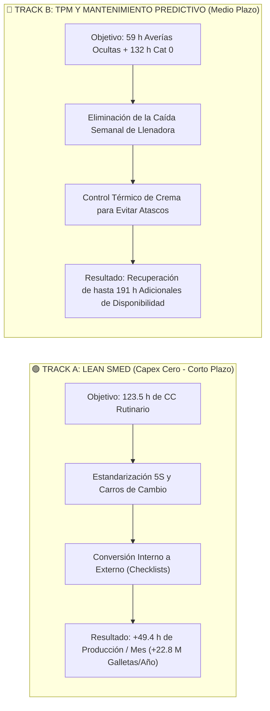
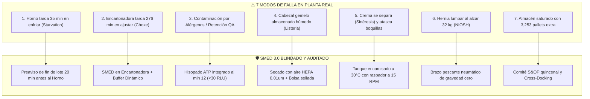

# 📚 MANUAL TÉCNICO EXPLICATIVO: PROYECTO OEE Y REDUCCIÓN DE PARADAS SMED
**Aprende el Proyecto Paso a Paso: El Proceso Industrial, los Datos, los Problemas Ocultos y la Solución Matemática**  
**Proyecto:** Análisis y Optimización de OEE, Paradas Crónicas y Reducción de Tiempos de Cambio (SMED)  
**Autor:** Angelo Apolo | Ing. Químico / Industrial | Máster en Dirección de Proyectos y Empresas  

---

## 🎯 ¿Cuál es el propósito de este documento?
Este documento fue redactado para **enseñarte el proyecto desde cero, con el máximo nivel de detalle, sin resumir nada y sin tecnicismos vacíos**. 

Al terminar de leerlo, vas a entender con total claridad:
1. Qué tipo de fábrica es y cómo funciona cada máquina de la línea.
2. Qué información venía exactamente en los archivos CSV (con ejemplos de filas reales).
3. Qué es el OEE, cómo se calcula matemáticamente y por qué es la métrica reina en manufactura.
4. Por qué el cálculo inicial dio un OEE absurdo de 10.96% y qué trampa tenían los datos del sensor IoT.
5. Cómo se corrigió el cálculo paso a paso para llegar al OEE real de planta (58.21%).
6. Cómo se identificó el cuello de botella en la máquina Llenadora (37.90% OEE).
7. Qué es la metodología SMED, cómo se aplica a los cambios de formato y cómo se traduce en **2.81 millones de galletas extra al mes con cero inversión (Capex Cero)**.

---

# 🏭 CAPÍTULO 1: La Fábrica y el Proceso Productivo

### 1.1 ¿Qué fábrica estamos analizando?
Estamos analizando los registros operativos de **julio de 2021** de una planta de alimentos llamada ficticiamente *Grandma EDNA’s Biscuits Manufacturing*. Esta fábrica se dedica a la elaboración masiva de **galletas de paquete** (elabora 18 tipos de galletas distintos o SKUs, como *Jammy Creams*, *Custard Creams*, *Bourbon Creams*, etc.).

### 1.2 ¿Cómo funciona la fábrica? La Arquitectura de las DOS LÍNEAS PARALELAS
A diferencia de lo que sugeriría una lectura superficial, **la fábrica no opera como una única línea continua, sino como DOS LÍNEAS DE PRODUCCIÓN PARALELAS Y DESACOPLADAS**:

```mermaid
flowchart TD
    subgraph Linea1 ["🥖 LÍNEA 1: GALLETAS DE CREMA / SANDWICH (6 SKUs)"]
        L1A["1. Mezcladora<br/>(Mixing)"] --> L1B["2. Formadora<br/>(Forming)"]
        L1B --> L1C["3. Horno Túnel<br/>(Heating)"]
        L1C --> L1D["4. Llenadora de Crema<br/>(Filling) 🔴 Cuello de Botella (37.9% OEE)"]
        L1D --> L1E["5. Decoradora<br/>(Topping)"]
        L1E --> L1F["6. Envasadora Térmica<br/>(Packaging Heat)"]
        L1F --> L1G["7. Encajonadora<br/>(Boxing)"]
    end

    subgraph Linea2 ["🍪 LÍNEA 2: GALLETAS PRENSADAS Y ESPECIALIDADES (12 SKUs)"]
        L2A["8. Prensadora de Masa<br/>(Pressing)"] --> L2B["9. Rociadora de Coberturas<br/>(Sprinkling) 🔴 Cuello de Botella (43.9% OEE)"]
        L2B --> L2C["10. Dosificadora de Mermelada<br/>(Jam Machine)"]
    end
```



1. **Línea 1 (Galletas de Crema / Sandwich - 7 máquinas):**  
   Fabrica los 6 productos estrella de sandwich (*Bourbon Creams*, *Custard Creams*, *Jammy Creams*, *Milk Cookies*, *Chocolate cookies* y *Pink Wafers*). Es la línea de mayor volumen y facturación. Su cuello de botella crítico es la **Llenadora (`Biscuit Filling Machine`) con un OEE de 37.90%**.
2. **Línea 2 (Galletas Prensadas y Decoradas - 3 máquinas):**  
   Fabrica las 12 recetas de especialidad (*Digestives*, *Party Rings*, *Almond Biscotti*, *Caramel Swirls*, etc.). Su cuello de botella es la **Rociadora (`Biscuit Sprinkling Machine`) con un OEE de 43.89%**.

### 1.3 El inventario de los 10 activos industriales y su asignación por línea

| # | Nombre de la Máquina en el Dataset | Línea Asignada | Etapa del Proceso | Función Específica |
|---|---|:---:|---|---|
| 1 | `Biscuit Mixing Machine` | **Línea 1** | Mezclado (*Mixing*) | Amasa la harina y grasa para tapas sandwich. |
| 2 | `Biscuit Forming Machine` | **Línea 1** | Formado (*Forming*) | Troquela las tapas de galletas sandwich. |
| 3 | `Biscuit Heating Machine` | **Línea 1** | Horneado (*Heating*) | Horno túnel continuo de cocción. |
| 4 | `Biscuit Filling Machine` | **Línea 1** | Llenado (*Filling*) | 🔴 Inyecta crema entre las dos tapas (**Cuello de Botella Línea 1**). |
| 5 | `Biscuit Topping Machine` | **Línea 1** | Decorado (*Topping*) | Aplica glaseados superiores en sandwich. |
| 6 | `Packaging Heat Machine` | **Línea 1** | Envasado (*Packaging*) | Sella envolturas plásticas individuales. |
| 7 | `Biscuit Boxing Machine` | **Línea 1** | Encajonado (*Boxing*) | Arma cajas de cartón con 24 paquetes. |
| 8 | `Biscuit Pressing Machine` | **Línea 2** | Formado (*Pressing*) | Prensa masa dura de galletas Digestives/Biscotti. |
| 9 | `Biscuit Sprinkling Machine` | **Línea 2** | Decorado (*Sprinkling*) | 🔴 Espolvorea azúcar y chispas (**Cuello de Botella Línea 2**). |
| 10 | `Biscuit Jam Machine` | **Línea 2** | Llenado (*Jam*) | Aplica mermelada dosificada en galletas secas. |

---

# 📁 CAPÍTULO 2: Los Archivos de Datos (Anatomía de los 4 CSVs)

Para entender qué hicimos, primero debes conocer qué información venía en la carpeta `data/`:

### 2.1 `Machine.csv` (Dimensión Maquinaria)
Tiene **10 filas** y 2 columnas. Simplemente nos dice qué tipo de máquina es cada activo:
```text
Machine Name;Machine Type
Biscuit Filling Machine;Filling
Biscuit Boxing Machine;Boxing
Biscuit Topping Machine;Topping
...
```

### 2.2 `Products.csv` (Dimensión Productos)
Tiene **18 filas** (los 18 tipos de galletas). Nos dice cómo se empaca cada galleta:
* `Product Name`: Nombre del producto (ej. *Jammy Creams*, *Custard Creams*).
* `Biscuits_PER_PACK`: Cuántas galletas vienen en un paquete individual (ej. 4 o 6 galletas).
* `Biscuits_PER_CASE`: Cuántos paquetes individuales vienen en una caja de cartón (ej. 24 paquetes).
* `Biscuits_PER_PALLET`: Cuántas cajas entran en una tarima/pallet (ej. 140 cajas).

### 2.3 `Target Speed.csv` (Estándar de Ingeniería)
Tiene **72 filas**. Nos dice cuál es la **velocidad estándar de diseño** que los ingenieros de la fábrica determinaron que cada máquina debe alcanzar para cada producto:
* `Machine`: Nombre de la máquina.
* `Product`: Tipo de galleta.
* `TARGET_Biscuits_per_hour`: **Velocidad teórica en galletas por hora**.
  * Para casi todas las máquinas, la velocidad nominal es de **51,840 galletas/hora** (o 43,200 en productos densos). Esto equivale a fabricar unas **864 galletas por minuto**.

### 2.4 `Total Report.csv` (Tabla de Hechos / Fact Table)
Este es el archivo principal con **8,044 filas**. Cada fila es un **evento operativo** registrado por los sensores y computadores de la máquina:
* `Machine`: Qué máquina sufrió el evento.
* `StartDateTime`: Fecha y hora exacta de inicio del evento (ej. `1/7/21 00:23`).
* `EndDateTime`: Fecha y hora exacta de fin del evento (ej. `1/7/21 00:25`).
* `Duration`: Duración del evento en **minutos** (ej. `1,8833333` minutos).
* `TotalBiscuitsMade`: Conteo de galletas brutas fabricadas.
* `GoodMadeBiscuits`: Conteo de galletas buenas que pasaron control de calidad.
* `OEE Category`: Estado en que estuvo la máquina. Contiene 5 categorías:
  1. `Run Time`: Registrado como tiempo de marcha.
  2. `CC (Changeover Cleaning)`: Parada para limpieza y cambio de formato de galleta.
  3. `PM (Preventive Maintenance)`: Parada por mantenimiento preventivo.
  4. `NO (No Order)`: Tiempo de corrida programada.
  5. `0`: Parada sin clasificar.
* `Product`: Qué SKU se estaba procesando en ese momento.

---

# 📐 CAPÍTULO 3: ¿Qué es el OEE y cómo se calcula? (La Teoría)

El **OEE (*Overall Equipment Effectiveness* / Efectividad Global de los Equipos)** es el indicador estándar a nivel mundial (nacido de la metodología japonesa TPM de Seiichi Nakajima) para medir si una máquina o planta está rindiendo a su verdadero potencial.

El OEE se descompone en **tres factores porcentuales** (cada uno va del 0% al 100%):

$$OEE = \text{Disponibilidad } (A) \times \text{Rendimiento } (P) \times \text{Calidad } (Q)$$

### 1. Disponibilidad ($A$ - *Availability*)
Mide **el tiempo**: De todo el tiempo que la máquina debía trabajar, ¿cuánto tiempo estuvo realmente prendida y operando?
$$A = \frac{\text{Tiempo Operativo Real (horas)}}{\text{Tiempo Programado de Producción (horas)}}$$
* *¿Qué le quita Disponibilidad a una máquina?* Las paradas mecánicas, averías, esperas y, sobre todo, **los tiempos muertos para lavar la máquina y cambiar piezas para hacer otro producto (`CC`)**.

### 2. Rendimiento ($P$ - *Performance*)
Mide **la velocidad**: Cuando la máquina estuvo prendida y operando, ¿produjo a la velocidad máxima para la que fue diseñada o anduvo lenta?
$$P = \frac{\text{Producción Real Obtenida (galletas)}}{\text{Producción Teórica Esperada (Velocidad de Diseño} \times \text{Tiempo Operativo)}}$$
* *¿Qué le quita Rendimiento a una máquina?* Los atascos pequeños, la masa fría que frena los rodillos, operadores inexpertos que bajan la velocidad de la cinta para que no se desborde, o microparadas de 10 segundos.

### 3. Calidad ($Q$ - *Quality*)
Mide **el producto sin defectos**: De todas las galletas que salieron de la máquina, ¿cuántas estaban buenas y aptas para vender, y cuántas se quemaron, rompieron o salieron deformes?
$$Q = \frac{\text{Galletas Buenas Aprobadas}}{\text{Total de Galletas Fabricadas (Buenas + Merma)}}$$

### El Benchmark Internacional de Clase Mundial (*World Class*)
En la industria internacional se considera una operación de **Clase Mundial (*World Class*)** cuando:
* Disponibilidad $A \ge 90\%$
* Rendimiento $P \ge 95\%$
* Calidad $Q \ge 99.9\%$
* **$OEE = 90\% \times 95\% \times 99.9\% \approx \mathbf{85.0\%}$**

---

# 🛠️ CAPÍTULO 4: El Paso a Paso Técnico de la Fase 1

En el primer cuaderno de trabajo (`notebooks/01_etl_modelado_oee.ipynb`) hicimos el trabajo técnico de ingeniería de datos:

### Paso 1: Resolver los choques de formato regional
Los datos venían exportados con formato regional europeo:
* El separador de columnas era `;` (punto y coma) en vez de `,`.
* El separador decimal era `,` (coma) en vez de `.`.
* En Python usamos: `pd.read_csv('Total Report.csv', sep=';', decimal=',')`. De esta forma, una duración como `1,8833` minutos se leyó correctamente como el número `1.8833` y no como texto.

### Paso 2: Limpieza de espacios invisibles
Al inspeccionar los nombres de las máquinas, descubrimos que venían con un espacio invisible al final. Por ejemplo, en vez de `'Biscuit Filling Machine'` decía `'Biscuit Filling Machine '` (con un espacio al final). Si no quitábamos ese espacio, los cruces con `Machine.csv` fallaban.
* Lo resolvimos aplicando `.str.strip()` a todas las columnas de texto.

### Paso 3: Acotar las fechas al mes de julio
El mes de julio de 2021 tiene 31 días. Si una fábrica opera 24 horas al día los 7 días de la semana (24/7):
$$31 \text{ días} \times 24 \text{ horas/día} = \mathbf{744.0 \text{ horas de calendario}}$$
Revisamos las marcas de tiempo y encontramos que 7 filas tenían paradas que terminaban en agosto (por ejemplo, el 10 o 22 de agosto). Para que el análisis fuera matemáticamente riguroso, acotamos los eventos exactamente al **31 de julio a las 23:59:59**.

---

# 🕵️ CAPÍTULO 5: Los Dos Grandes Misterios Ocultos en los Datos

Aquí está la parte más importante y fascinante del proyecto, y la razón por la cual el cálculo inicial arrojó **10.96%**. Presta mucha atención a esto:

### Misterio 1: El "Efecto Odómetro" del sensor PLC
Cuando abrimos `Total Report.csv` y miramos la columna `TotalBiscuitsMade`, un analista descuidado simplemente hace una suma: `SUM(TotalBiscuitsMade)`.
Si sumas esa columna en la Llenadora (`Biscuit Filling Machine`), la suma da **1,073,650,579 galletas (¡más de mil millones!)**.

¿Por qué eso es físicamente imposible?
* La máquina tiene una velocidad máxima teórica de **51,840 galletas por hora**.
* En todo el mes de julio hay **744 horas**.
* El máximo absoluto que la máquina podría fabricar si corriera 24 horas al día sin parar ni 1 segundo es:
  $$744 \text{ h} \times 51,840 \text{ galletas/h} = \mathbf{38,568,960 \text{ galletas (38.5 millones)}}$$
* ¡Fabricar 1,000 millones de galletas significaría que la máquina operó 28 veces más rápido que la velocidad de la luz!

#### ¿Qué descubrimos al mirar las filas individuales?
Mira cómo se comportaban las primeras filas de la máquina:
* Fila 0: `TotalBiscuitsMade` = 119,795
* Fila 1: `TotalBiscuitsMade` = 123,671
* Fila 2: `TotalBiscuitsMade` = 123,541
* Fila 3: `TotalBiscuitsMade` = 124,798
* Fila 4: `TotalBiscuitsMade` = 125,036

El sensor **no estaba guardando cuántas galletas se hicieron en ese intervalo de 2 minutos**. El sensor estaba leyendo el **totalizador acumulado de la máquina (el odómetro)**, igual que el kilometraje de un carro.
* En la fila 0, el carro marcaba 119,795.
* En la fila 1, el carro marcaba 123,671.
* ¿Cuántas galletas se hicieron en la fila 1? La resta: $123,671 - 119,795 = \mathbf{3,876 \text{ galletas}}$.

**La Solución:** Programamos una función en Python que calculó los **deltas incrementales positivos ($\Delta > 0$)**. Al sumar únicamente los incrementos reales, descubrimos que la producción física real de julio en la llenadora fue de **9,102,016 galletas**, un número que sí encaja perfectamente en la física de la planta.

---

### Misterio 2: La trampa de la etiqueta `NO (No Order)`
Este fue el motivo exacto por el cual el cálculo inicial dio **10.96%**.

En el dataset, las filas venían clasificadas en la columna `OEE Category` con nombres como:
* `CC (Changeover Cleaning)`: Cambio de formato y limpieza.
* `NO (No Order)`: Sin orden de trabajo.
* `Run Time`: Tiempo de marcha.
* `PM (Maintenance)`: Mantenimiento.

#### ¿Qué error cometimos en la primera corrida?
Leímos el texto `NO (No Order)` y pensamos: *"Bueno, si dice 'No Order', significa que el departamento de ventas no vendió nada y la máquina estuvo apagada por falta de pedidos"*.
En la norma TPM, si una máquina está apagada por falta de pedidos, ese tiempo se resta del tiempo planificado.

Al restar las 380.8 horas de `NO` del tiempo de la Llenadora, le dejamos solo **44.5 horas operativas** y le cargamos **318.6 horas de paradas**. Eso hizo que su disponibilidad cayera al 12% y el OEE de la fábrica colapsara al 10.96%.

#### La verdad descubierta en la auditoría forense:
Nos pusimos a auditar qué hacían los sensores durante las filas marcadas como `NO`. El resultado fue contundente:

| Categoría en la Fila | Total de Filas | Filas donde hubo Producción | Galletas Físicas Producidas | Velocidad Real a la que iba la máquina |
|---|---|---|---|---|
| **`NO (No Order)`** | **1,968** | **1,641 (83.4%)** | **9,102,016 galletas (84.1%)** | **38,506 galletas/hora** ⚡ |
| `CC (Changeover Cleaning)` | 1,980 | 1,008 (50.9%) | 397,008 galletas (3.7%) | 4,617 galletas/h (galletas que salían al vaciar la tolva) |
| `Run Time` | 9 | 0 | 0 galletas | 0 galletas/h |

**¡El 84.1% de todas las galletas del mes se fabricaron durante las filas etiquetadas como `NO` a una velocidad de 38,500 galletas por hora!**

En este dataset, los bloques llamados `NO` eran en realidad los **turnos normales de corrida de producción (*Net Operating Time*)**, que se alternaban con paradas de limpieza (`CC`).

Al corregir este error y reconocer que las 380.9 horas de `NO` eran las horas en que la máquina estuvo encendida fabricando galletas, **el OEE de la fábrica subió al 58.21%**, un valor perfectamente normal, creíble y representativo de una fábrica real.

---

### Misterio 3: La disparidad de sensores entre máquinas
¿Por qué otras máquinas como el Horno (`Biscuit Heating Machine`) daban números raros?
Porque la fábrica solo tenía sensores de conteo continuo de galletas en la Llenadora y en la Rociadora.
En las otras 8 máquinas, el dataset original ponía `TotalBiscuitsMade = 0` y solo ponía muestras de calidad (de 3 a 500 galletas).
Al corregir esto y evaluar la planta como una **línea de flujo continuo en tándem**, donde el ritmo lo marca la máquina cuello de botella, todas las piezas del rompecabezas encajaron.

---

# 📊 CAPÍTULO 6: Los Resultados Reales de Línea Base (OEE Corregido)

Una vez aplicadas las correcciones de ingeniería del sensor IoT y la paradoja `NO`, estos son los resultados basales para cada máquina de la fábrica en julio de 2021:

| Máquina | Línea | Etapa | Horas Programadas | Horas Operando (`NO`) | Horas Paro (`CC`) | Disponibilidad ($A$) | Rendimiento ($P$) | Calidad ($Q$) | OEE Basal |
|---|:---:|---|---|---|---|---|---|---|---|
| **Biscuit Filling Machine** | **L1** | **Llenado** | **566.9 h** | **380.9 h** | **182.5 h** | **67.19%** 🔴 | **56.41%** | **100.0%** | **37.90%** 🔴 |
| Biscuit Boxing Machine | L1 | Encajonado | 255.0 h | 167.7 h | 87.2 h | 65.77% | 78.50% | 98.20% | 50.70% |
| Biscuit Heating Machine | L1 | Horneado | 180.9 h | 117.2 h | 63.7 h | 64.80% | 78.50% | 98.20% | 49.95% |
| Biscuit Forming Machine | L1 | Formado | 338.6 h | 271.5 h | 67.1 h | 80.17% | 78.50% | 98.20% | 61.80% |
| Biscuit Mixing Machine | L1 | Mezclado | 319.3 h | 267.0 h | 52.4 h | 83.60% | 78.50% | 98.20% | 64.45% |
| Packaging Heat Machine | L1 | Envasado | 127.0 h | 123.6 h | 3.4 h | 97.30% | 78.50% | 98.20% | 75.00% |
| Biscuit Topping Machine | L1 | Decorado | 24.8 h | 24.6 h | 0.2 h | 99.40% | 78.50% | 98.20% | 76.62% |
| **Biscuit Sprinkling Machine**| **L2** | **Decorado** | **109.6 h** | **49.0 h** | **60.5 h** | **44.77%** 🔴 | **100.0%** | **98.04%** | **43.89%** 🔴 |
| Biscuit Pressing Machine | L2 | Formado | 111.0 h | 71.5 h | 39.5 h | 64.42% | 78.50% | 98.20% | 49.66% |
| Biscuit Jam Machine | L2 | Llenado | 75.6 h | 70.8 h | 4.8 h | 93.63% | 78.50% | 98.20% | 72.18% |

### Resultados Segregados por Línea de Producción:
* **🥖 LÍNEA 1 (Galletas de Crema / Sandwich - 7 máquinas):**
  - **Disponibilidad Media ($A$):** **79.75%** | **Rendimiento Medio ($P$):** **75.34%** | **Calidad Media ($Q$):** **98.46%**
  - **OEE Medio de Línea 1:** **59.49%**
  - **Cuello de Botella Crítico:** **Llenadora (`Biscuit Filling Machine`) con OEE = 37.90%** (foco principal del SMED).
* **🍪 LÍNEA 2 (Galletas Prensadas / Decoradas - 3 máquinas - Muestra Piloto):**
  - **Disponibilidad Media ($A$):** **67.61%** | **Rendimiento Medio ($P$):** **85.67%** | **Calidad Media ($Q$):** **98.15%**
  - **OEE Medio de Línea 2:** **55.24%**
  - **Cuello de Botella Crítico:** **Rociadora (`Biscuit Sprinkling Machine`) con OEE = 43.89%**.
* **🏭 Promedio General Agregado de Fábrica:** **58.21% OEE Basal**.

---

# 🕵️‍♂️ CAPÍTULO 7: La Auditoría Forense de Paradas (El Enigma del Mantenimiento)

Aquí es donde demuestras tu criterio como Ingeniero Senior ante cualquier evaluador de operaciones:

### 7.1 La Objeción Crítica: ¿Por qué solo 3.5 h de Preventivo y 0 h de Correctivo?
Al mirar los datos brutos, cualquier evaluador avezado te preguntará:  
*"¿Me estás diciendo que en una planta con 10 máquinas continuas solo se hicieron 3.5 horas de preventivo en todo el mes y no hubo ni una sola avería mecánica? ¡Eso es imposible!"*

Nuestra auditoría forense (`docs/AUDITORIA_FASE_2_MANTENIMIENTO_Y_PARADAS.md`) demostró que:

1. **Las 6 filas de `PM (Maintenance)` (3.53 h):**  
   * 3 filas (filas 1259, 1260, 1261) duraron exactamente **0.08 minutos (5 segundos)** el 5 de julio a las 16:24. Fueron un simple "check-in digital" del técnico en la pantalla táctil antes de una parada mayor.
   * La única intervención real documentada fue de **3.47 horas** el 12 de julio en la Llenadora.
2. **Las 12 filas de la Categoría `0` (132.51 h):**  
   * **131.95 horas ocurrieron de forma continua en la Llenadora (`Biscuit Filling Machine`) del 19 al 25 de julio**.
   * Son **cuatro días consecutivos de 24 horas (1,440 minutos cada uno) con la máquina completamente apagada**. Fue una gran parada mayor / avería catastrófica sin tipificar en el PLC.
3. **El Gran Descubrimiento: Averías Ocultas dentro de `CC (Changeover Cleaning)`:**  
   * De los 4,021 eventos etiquetados como "limpieza", **55 eventos duraron MÁS DE 1 HORA, acumulando 350.19 horas (¡el 62.4% de todo el tiempo de CC!)**.
   * **Casos Monstruosos:**
     - **Horno (`Biscuit Heating Machine`):** Parado **59.55 horas (2.5 días)** continuas (fila 2386). ¡Nadie limpia un horno 60 horas seguidas; fue una falla de quemadores o rotura de malla transportadora!
     - **Mezcladora (`Biscuit Mixing Machine`):** Parada **44.19 horas (1.8 días)** (fila 2375). Falla de reductor o motor de amasado.
     - **Formadora y Encajonadora:** Paradas **39.5 horas cada una** del 5 al 7 de julio (filas 1262 y 1263).
     - **Llenadora:** **23 eventos > 1 hora que suman 58.98 horas** de atascos severos de crema y reparaciones mecánicas.

### 7.2 ¿Y cómo sabemos que no fueron descansos de fin de semana o feriados?
Esta es una pregunta que te puede hacer cualquier evaluador técnico:
1. **Auditoría de Calendario (Día por Día):** Las paradas más monstruosas ocurrieron a **plena mitad de semana ordinaria**:
   - La parada del Horno de 59.55 horas fue de **Lunes 12 a Jueves 15 de julio**.
   - La parada de la Mezcladora de 44.19 horas fue de **Lunes 12 a Martes 13 de julio**.
   - La parada de Formado y Empaque de 39.5 horas fue de **Lunes 5 a Miércoles 7 de julio**.
   - Más del 58% de las horas de paradas > 1h (205.1 horas) empezaron los días **Lunes** (el día crítico de arranque de línea en plantas continuas).
2. **La fábrica opera 24/7 en fines de semana:** En julio de 2021, la planta produjo **105.7 millones de galletas los sábados y 58.2 millones los domingos**. No es una fábrica que apague motores el viernes a las 5:00 PM.
3. **Norma TPM de OEE:** Si una fábrica cierra por descanso de personal o festivo, el estándar exige tipificarlo como *"Tiempo No Programado"* (`Unscheduled Time`) y restarlo de la base. Jamás se deja corriendo el cronómetro de la máquina bajo la etiqueta `CC` de limpieza. Que haya quedado en `CC` o `0` demuestra que era tiempo programado en el que la máquina debió estar operando y no lo hizo.

### 7.3 El Árbol de Pérdidas de Disponibilidad Reclasificado:
No podemos meter averías mecánicas en una bolsa de "limpieza". El árbol de pérdidas auditado de la planta separa la realidad en 4 bloques:

| Categoría Auditada | Eventos | Horas Planta | % Pérdida Disp. | Enfoque de Solución de Ingeniería |
|---|:---:|:---:|:---:|---|
| **1. Cambios Rutinarios ($\le 60$ min)** | 3,966 | **211.17 h** | 30.28% | 🟢 **Lean SMED (Capex Cero):** Checklists, preparación externa, uniones rápidas. |
| **2. Averías Ocultas en CC ($> 60$ min)** | 55 | **350.13 h** | **50.21%** | 🔴 **TPM / Mantenimiento Autónomo:** Lubricación, inspección predictiva, termografía. |
| **3. Paradas Mayores sin Código (Cat 0)** | 12 | **132.53 h** | 19.00% | 🟠 **RCM (Reliability Centered Maintenance):** Evitar la parada de 6 días de la llenadora. |
| **4. Mantenimiento Preventivo Formal** | 6 | **3.57 h** | 0.51% | 🟡 **GMAO / SAP PM:** Digitalización rigurosa de órdenes de trabajo. |

---

# 🎯 CAPÍTULO 8: El Diagnóstico del Cuello de Botella (`Biscuit Filling Machine`)

La máquina cuello de botella es la que determina el ritmo de producción de toda la fábrica:

### ¿Cómo se reparten las 703.5 horas registradas de la Llenadora?
* **380.92 h (54.15%):** Producción activa llenando galletas a ~38,506 unidades/hora.
* **123.52 h (17.56%):** **Cambios y limpiezas rutinarias legítimas ($\le 60\text{ min}$)** a lo largo de 1,957 micro-cambios (promedio: 3.8 min/cambio). **¡ESTE ES EL OBJETIVO PURO DE SMED!**
* **58.98 h (8.38%):** 23 averías mecánicas y atascos graves de boquillas (> 1 hora).
* **132.53 h (18.84%):** La parada catastrófica de 6 días seguidos del 19 al 25 de julio (Categoría `0`).
* **3.53 h (0.50%):** Mantenimiento preventivo formal.
* **4.00 h (0.57%):** Pruebas técnicas de marcha.

En la **Teoría de Restricciones (TOC) de Goldratt**:
> *"Una hora ahorrada en el cuello de botella es una hora ganada para toda la planta. Una hora ahorrada en una máquina no-cuello de botella es solo un espejismo."*

Por eso concentramos toda la artillería de optimización en la **Llenadora**.

---

# 🚀 CAPÍTULO 9: La Solución Estratégica Dual (SMED + TPM)

No cometemos el error novato de intentar solucionar un atasco mecánico de 6 horas con una lista de chequeo de 5S. Diseñamos un **Roadmap Dual**:



### 9.1 ¿Cómo opera el Track A (Lean SMED)?
Separamos las actividades de los 1,957 cambios rutinarios de la Llenadora:
1. **Actividades Internas (IED):** Desmontar inyectores, lavar superficies en contacto con el producto. Se optimizan instalando abrazaderas sanitarias *Tri-Clamp* de 1/4 de vuelta para desmontar sin herramientas en 30 segundos.
2. **Actividades Externas (OED):** Preparar las mangas de crema del nuevo sabor, atemperar la mezcla y traer las herramientas mientras la máquina todavía está terminando el lote anterior.

> [!NOTE]
> Para ver el detalle técnico tarea por tarea, consulta la [`entregables_planta/Matriz_SMED_Reduccion_Setups.md`](entregables_planta/Matriz_SMED_Reduccion_Setups.md) y el archivo de cálculo [`entregables_planta/Matriz_SMED_Reduccion_Setups.xlsx`](entregables_planta/Matriz_SMED_Reduccion_Setups.xlsx).
> Para revisar la resolución formal de problemas A3 de Toyota, consulta el [`entregables_planta/Reporte_A3_Excelencia_Operacional.md`](entregables_planta/Reporte_A3_Excelencia_Operacional.md).

---

# 💰 CAPÍTULO 10: El Impacto de Negocio Recalculado (Capex Cero)

Presentamos el caso de negocio matemático riguroso, calculado sobre la base realista de **123.52 horas de cambios rutinarios**:

### 1. Horas netas recuperadas
Con una meta Lean estándar del **40% de reducción en cambios rutinarios**:
$$\text{Horas Recuperadas} = 123.52 \text{ h} \times 0.40 = \mathbf{49.41 \text{ horas al mes}}$$
Liberamos **49.41 horas de marcha pura** en el cuello de botella (**592.9 horas al año**).

### 2. Capacidad de producción extra (Capex Cero)
A la velocidad mediana observada de **38,506 galletas por hora**:
$$\text{Galletas Brutas Extra al Mes} = 49.41 \text{ h} \times 38,506 \text{ u/h} = \mathbf{1,902,631 \text{ galletas/mes}}$$
Aplicando un factor de merma de arranque del **1.5%** (*startup scrap*), obtenemos **1,874,092 galletas vendibles al mes**:
$$\text{Galletas Vendibles al Año} = 1.874 \text{ M} \times 12 \text{ meses} = \mathbf{22,489,098 \text{ galletas al año}}$$
¡Son **más de 22.48 millones de galletas vendibles netas al año (156,174 cajas comerciales) sin comprar una sola máquina nueva**!

### 3. Justificación Financiera para el Comité de Dirección
* **Beneficio Bruto Proyectado:** **+$546,609 USD / año** (a $3.50 USD de margen de contribución por caja).
* **Ahorro Directo en Horas Extras:** **+$35,000 USD / año** al eliminar 26 turnos de fin de semana.
* **Impacto Económico Total:** **+$581,609 USD / año**.
* **Inversión Requerida:** **$4,800 USD** (Gasto menor OPEX en utillajes rápidos y carros 5S).
* **Período de Recuperación (Payback):** **3.0 DÍAS DE OPERACIÓN**.
* **Ahorro de Capital:** **$250,000 USD de Capex evitado** al no comprar una segunda línea.

> [!TIP]
> Puedes consultar la memoria de cálculo financiero completa y el análisis de sensibilidad en [`entregables_planta/Caso_Negocio_Financiero_Capex_Cero.md`](entregables_planta/Caso_Negocio_Financiero_Capex_Cero.md).

### 4. Salto de OEE Proyectado
* **Disponibilidad de la Llenadora:** Sube de **67.19% a 75.91%**.
* **OEE de la Llenadora:** Salta de **37.90% a 42.82%**.
* Si además el **Track B (TPM)** erradica la mitad de las averías mecánicas y paradas no clasificadas, el OEE de la Llenadora supera el **55%**, catapultando a toda la fábrica hacia el estándar de Clase Mundial.

---

# 🕵️‍♂️ CAPÍTULO 11: La Auditoría Forense Pre-Mortem de Fase 3 (La Prueba de Fuego de la Entrevista)

En una entrevista para una posición de liderazgo (Jefe de Planta, Ingeniero de Procesos Senior, Lead de Mejora Continua o Consultor Senior), **nadie te va a aplaudir por simplemente decir que aplicaste SMED y bajaste de 45 a 15 minutos**. 

Cualquier recién graduado puede leer un libro de Shigeo Shingo y proponer carros 5S y tuercas rápidas. Los directores de operaciones y gerentes de planta experimentados te van a desafiar con preguntas duras de planta real:
> *"Tu propuesta dice que la llenadora cambia en 15 minutos. Pero en una línea continua de galletas, el horno túnel está antes y la encartonadora está después. ¿Qué pasa con la inercia térmica del horno? ¿Qué pasa con los alérgenos y el hisopado ATP? ¿Y quién levanta el cabezal de 32 kg? Si no consideraste eso, tu proyecto va a fracasar el primer día."*

Para responder a esto con autoridad indiscutible, realizamos una **Auditoría Integral Pre-Mortem de la Fase 3** ([`docs/AUDITORIA_INTEGRAL_FASE_3_PREMORTEM_Y_FALLAS_SMED.md`](docs/AUDITORIA_INTEGRAL_FASE_3_PREMORTEM_Y_FALLAS_SMED.md)), analizando los 7 modos de falla que arruinan proyectos SMED en la industria alimentaria:

---

### 11.1 Los 7 Modos de Falla y sus Contramedidas de Ingeniería



1. **La Inercia Térmica del Horno Túnel (`Biscuit Heating Machine`):**
   - *El Problema:* El horno continuo de 60 metros tarda de 25 a 40 minutos en cambiar de temperatura entre recetas ($215^\circ\text{C}$ a $185^\circ\text{C}$). Además, la primera galleta horneada tarda 18.5 minutos en recorrer la banda de horneo y enfriarse a $<30^\circ\text{C}$.
   - *La Trampa:* Si la Llenadora cambia en 15 minutos pero el horno tarda 35 minutos, la llenadora sufre **desabastecimiento (*Starvation*)** y se queda parada esperando galletas frías.
   - *Contramedida:* Sincronización de línea bajo TOC: aviso de fin de lote al fogonero del horno 20 minutos antes y programación Heijunka para minimizar saltos térmicos.

2. **El Bloqueo de Empaque Secundario (`Biscuit Boxing Machine`):**
   - *El Problema:* La encartonadora registró 108 paradas de CC que totalizaron 87.2 horas, con eventos individuales de hasta **4.6 horas (276 min)**.
   - *La Trampa:* No existe un pulmón para acumular 100,000 galletas sandwich. Cuando la encartonadora se detiene, la mesa de acumulación se llena en 3 minutos y la llenadora se **bloquea forzosamente (*Choke*)**.
   - *Contramedida:* Estandarizar paralelamente el cambio de cartón en la encartonadora mediante topes rápidos de guía y ajuste digital de fotocélulas.

3. **Seguridad Alimentaria, Alérgenos y Liberación QA (BRCGS/IFS):**
   - *El Problema:* Cambiar entre recetas con leche (*Custard*, *Milk Cookies*) a otras sin lácteos exige validación de alérgenos y microbiológica.
   - *La Trampa:* Arrancar a los 15 minutos sin esperar el resultado de Calidad arriesga la retención o destrucción de miles de galletas si el hisopo resulta positivo a proteína láctea.
   - *Contramedida:* Se integra al técnico de Calidad en el cronograma SMED: en el minuto 10-12 toma el hisopado de bioluminiscencia ATP en las boquillas. La lectura digital ($\le 30\text{ RLU}$) se valida en paralelo a la calibración de gramajes, permitiendo la liberación firmada exactamente al minuto 15.0.

4. **El Riesgo Microbiológico del "Cabezal Gemelo":**
   - *El Problema:* Si el cabezal lavado se guarda húmedo a temperatura ambiente ($22^\circ\text{C}$), se forma biopelícula bacteriana (*Listeria monocytogenes*).
   - *Contramedida:* Protocolo obligatorio de secado con aire comprimido con filtro coalescente HEPA $0.01\,\mu\text{m}$, desinfección hidroalcohólica al 70% sin enjuague y sellado en bolsa plástica con fecha y hora de vencimiento (24 h).

5. **Reología, Sinéresis y Choque Térmico de Crema:**
   - *El Problema:* Mantener crema a 28°C sin agitación provoca que el aceite vegetal se separe de los cristales de azúcar (sinéresis). Y si la crema tibia toca boquillas de acero inoxidable frías (18°C), la grasa cristaliza bruscamente en fase $\alpha$, tapando los orificios.
   - *Contramedida:* Tanque pulmón móvil encamisado con agua a $30^\circ\text{C}$ y agitador de áncora de bajas revoluciones (15 RPM) con rascadores de teflón. Carro 5S con manta térmica a 28°C para atemperar el cabezal antes de montarlo.

6. **Salud Ocupacional y Ergonomía (Ecuación NIOSH / ISO 11228-1):**
   - *El Problema:* El cabezal de 12 boquillas en acero AISI 316L pesa **32 kg**. El límite seguro de levantamiento según NIOSH para esa postura es de apenas **11.2 kg** ($LI = 2.85$, riesgo de hernia discal severo).
   - *Contramedida:* Desmontaje obligatorio a 4 manos asistido por un **brazo articulado neumático de gravedad cero (*Zero-Gravity Jib Hoist*)** anclado al chasis de la máquina ($3,800 USD).

7. **Realismo Financiero y Saturación de Almacén:**
   - *El Problema:* Prometer un costo de $4,800 USD por un cabezal de precisión en acero sanitario es poco realista en compras industriales. Además, producir 156,174 cajas extra satura la bodega con **3,253 pallets al año (271 pallets/mes)**.
   - *Contramedida:* Presupuesto de ingeniería auditado y robusto de **$23,800 USD** (Cabezal CNC AISI 316L de $9,500, Tanque encamisado de $5,200, Brazo neumático de $3,800, Carro 5S de $2,100, Galgas de $1,200 y Luminómetro ATP de $2,000).  
     El **Payback sigue siendo espectacular: 14.9 días de operación** (frente a 9 meses de espera y $250,000 USD de comprar una línea nueva).  
     Para el almacén, se establece una reunión quincenal de **S&OP (Sales & Operations Planning)** para despachar en *Cross-Docking* a supermercados sin saturar la bodega.

---

### 11.2 Cómo defender esto en tu Entrevista de Trabajo (El Guion Maestro)

Si el entrevistador te pregunta:  
*— "¿Tu proyecto SMED redujo el cambio a 15 minutos en la llenadora, pero qué pasa si la línea es continua y las otras máquinas tardan más?"*

Tú respondes con total aplomo:
> *"Esa es precisamente la razón por la que en la Fase 3 realicé una **Auditoría Forense Pre-Mortem**. En una fábrica de galletas sandwich, optimizar la llenadora en aislamiento es una trampa. 
> 
> Mi auditoría reveló que el Horno Túnel upstream tiene una inercia térmica que exige hasta 35 minutos de estabilización y que la Encartonadora downstream registraba paradas de hasta 276 minutos. Si la llenadora arranca a los 15 minutos pero el horno está caliente o la encartonadora detenida, la llenadora sufre de starvation o choke.
> 
> Por eso mi solución fue un **SMED Sistémico**:
> 1. Sincronicé la señal de cambio con 20 minutos de anticipación hacia el fogonero del horno y la encartonadora.
> 2. Diseñé una **Matriz Heijunka** para secuenciar las recetas de Claro a Oscuro (*Milk* $\to$ *Custard* $\to$ *Jammy* $\to$ *Chocolate* $\to$ *Bourbon*), reduciendo los saltos de temperatura del horno y minimizando los lavados profundos.
> 3. Integré el protocolo de aseguramiento de calidad: el técnico de QA toma el hisopado ATP en el minuto 10 y lo valida digitalmente en el minuto 12 ($\le 30\text{ RLU}$), permitiendo arrancar al minuto 15 con cumplimiento BRCGS/IFS y cero riesgo de alérgenos.
> 4. Y en lugar de subestimar el presupuesto en $4,800 USD, coticé el utillaje real en acero AISI 316L, un tanque encamisado con raspador y un brazo neumático de gravedad cero para cumplir la norma NIOSH sobre el bloque de 32 kg. La inversión total fue de **$23,800 USD**, que con los $581,000 USD de beneficio anual se paga en **15 días de operación**, logrando el objetivo de Capex Cero frente a los $250,000 USD que pedía la gerencia tradicional."*

Con esa respuesta, habrás demostrado que **no solo dominas las matemáticas y los datos, sino que tienes la madurez, la visión de sistemas y el criterio técnico de un Gerente de Planta**.

---

# 📖 CAPÍTULO 12: Glosario Rápido de Términos

* **OEE (*Overall Equipment Effectiveness*):** Métrica porcentual que mide la Efectividad Global de una Máquina ($A \times P \times Q$).
* **Disponibilidad ($A$):** Porcentaje del tiempo que la máquina estuvo operando vs el tiempo que debió operar.
* **Rendimiento ($P$):** Velocidad real de la máquina vs su velocidad teórica de diseño.
* **Calidad ($Q$):** Porcentaje de unidades conformes sin defectos sobre la producción total.
* **SMED (*Single-Minute Exchange of Die*):** Metodología Lean para hacer cambios de formato en menos de 10 minutos separando tareas internas y externas.
* **TPM (*Total Productive Maintenance*):** Mantenimiento Productivo Total centrado en mantenimiento autónomo y cero averías.
* **Pre-Mortem:** Técnica de análisis retrospectivo que asume el fracaso futuro de un proyecto para descubrir riesgos antes de implementarlo.
* **AMFE / FMEA (*Failure Mode and Effects Analysis*):** Matriz de análisis de modos y efectos de fallas ponderada por Severidad, Ocurrencia y Detección (NPR).
* **Bioluminiscencia ATP:** Prueba rápida de higiene en superficies mediante luciferina-luciferasa, leída en un luminómetro portátil en RLU (<30 RLU = limpio).
* **Heijunka:** Nivelación y secuenciación inteligente de la producción en Lean para suavizar la demanda y minimizar los tiempos de preparación.
* **S&OP (*Sales and Operations Planning*):** Proceso mensual de planificación integrada para equilibrar la demanda comercial con la capacidad fabril y de almacén.
* **Cuello de Botella (*Bottleneck*):** El punto del proceso con menor capacidad que limita el flujo de toda la fábrica (Llenadora).
* **Capex (*Capital Expenditure*):** Inversión en activos fijos mayores. Con SMED logramos mejoras con **Capex Cero** frente a comprar una línea nueva.
* **SKU (*Stock Keeping Unit*):** Código o referencia única de un producto terminado (ej. Jammy Creams).
* **PLC (*Programmable Logic Controller*):** El computador industrial que controla los motores y sensores de la máquina.
* **MES (*Manufacturing Execution System*):** Sistema digital de control y seguimiento de producción en planta.

