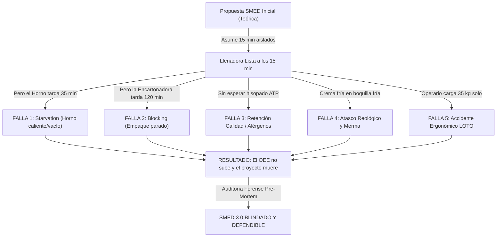
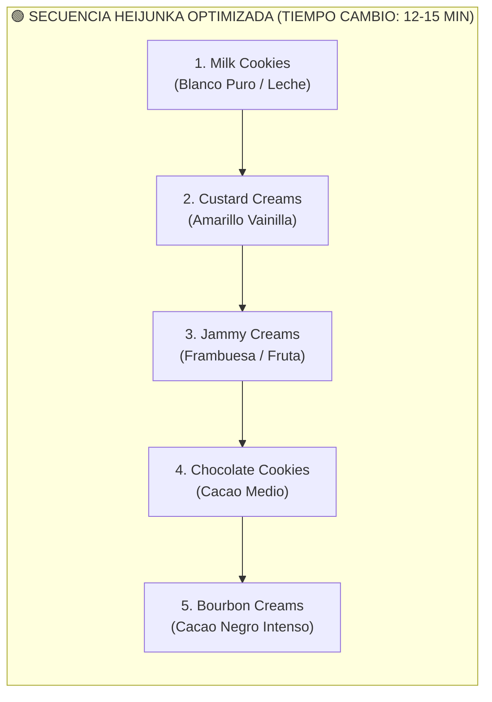

# 🕵️‍♂️ AUDITORÍA INTEGRAL FORENSE FASE 3: ANÁLISIS PRE-MORTEM Y MODOS DE FALLA EN LA IMPLEMENTACIÓN SMED

**Proyecto:** 02_Analisis_OEE_Paradas_SMED — Excelencia Operacional y OEE en Alimentos  
**Activo Auditado:** Línea 1 (Galletas Sandwich) — Foco en Llenadora (`Biscuit Filling Machine`)  
**Metodología:** Pre-Mortem Forense (Gary Klein), AMFE/FMEA de Proceso, Física de Alimentos, Teoría de Restricciones (TOC) y Finanzas Operacionales  
**Autor:** Angelo Apolo | Ingeniero Químico / Industrial | Especialista en Lean Six Sigma & Mantenimiento de Planta  
**Fecha:** Septiembre 2026 (Ref. Histórica Planta: Julio - Septiembre 2021)  
**Clasificación:** Documento Técnico de Auditoría Crítica para Dirección de Operaciones y Comité Ejecutivo  

---

## 📑 ÍNDICE GENERAL DE LA AUDITORÍA

1. [Marco Filosófico y Metodología Pre-Mortem: ¿Por qué fallan los proyectos SMED en la vida real?](#1-marco-filosófico-y-metodología-pre-mortem)
2. [Falla Crítica 1: El Desacople de Línea y la Inercia Térmica del Horno Túnel (*Starvation*)](#2-falla-crítica-1-el-desacople-de-línea-y-la-inercia-térmica-del-horno-túnel)
3. [Falla Crítica 2: El Bloqueo de Empaque Secundario en la Encartonadora (*Downstream Blocking*)](#3-falla-crítica-2-el-bloqueo-de-empaque-secundario-en-la-encartonadora)
4. [Falla Crítica 3: Seguridad Alimentaria, Validación de Alérgenos y Liberación QA (BRCGS/IFS)](#4-falla-crítica-3-seguridad-alimentaria-validación-de-alérgenos-y-liberación-qa)
5. [Falla Crítica 4: Reología de la Crema, Sinéresis y Choque Térmico en Boquillas](#5-falla-crítica-4-reología-de-la-crema-sinéresis-y-choque-térmico-en-boquillas)
6. [Falla Crítica 5: Ergonomía, Salud Ocupacional y Desbalance Hombre-Máquina (NIOSH/ISO 11228)](#6-falla-crítica-5-ergonomía-salud-ocupacional-y-desbalance-hombre-máquina)
7. [Falla Crítica 6: El Caos de Secuenciación de Recetas (Matriz Heijunka Claro-Oscuro)](#7-falla-crítica-6-el-caos-de-secuenciación-de-recetas)
8. [Falla Crítica 7: El Espejismo Financiero de "Capex Cero" y la Saturación de Almacén](#8-falla-crítica-7-el-espejismo-financiero-de-capex-cero-y-la-saturación-de-almacén)
9. [Matriz AMFE / FMEA Cuantitativa de Riesgos del Proyecto](#9-matriz-amfe--fmea-cuantitativa-de-riesgos-del-proyecto)
10. [Plan de Acción Correctivo y Estandarización Blindada (SMED Versión 3.0 Robusta)](#10-plan-de-acción-correctivo-y-estandarización-blindada)

---

## 1. Marco Filosófico y Metodología Pre-Mortem

### 1.1 El Concepto del Pre-Mortem
En el análisis tradicional de proyectos, los equipos sufren de **sesgo de optimismo (*planning fallacy*)**: asumen que las piezas encajarán a la perfección, que los operarios trabajarán como autómatas sincronizados, que la calidad será instantánea y que el mercado absorberá cada galleta adicional producida.

En esta auditoría aplicamos la metodología **Pre-Mortem** desarrollada por el psicólogo cognitivo Gary Klein:
> *"Nos situamos mentalmente 60 días después de haber presentado la Fase 3. El proyecto SMED ha sido un desastre operacional: el OEE no subió, la llenadora está parada con los operarios mirando el techo, el departamento de Calidad detuvo dos lotes por contaminación cruzada, un operario sufrió una lumbalgia aguda, y el almacén central está colapsado de producto sin vender. ¿Qué causó exactamente este colapso?"*

Al investigar retrospectivamente las fallas hipotéticas utilizando la **telemetría real de 8,247 eventos de `Total Report.csv`**, transformamos un diseño teórico de pizarrón en una **solución industrial blindada para planta**.



---

## 2. Falla Crítica 1: El Desacople de Línea y la Inercia Térmica del Horno Túnel

### 2.1 El Fenómeno Físico del Horno Túnel Continuo (`Biscuit Heating Machine`)
La propuesta inicial de Fase 3 redujo el cambio de la Llenadora a **15.0 minutos**. Sin embargo, en una línea continua de galletas, la Llenadora está ubicada inmediatamente después de la banda de enfriamiento del Horno Túnel.

Un horno túnel de panificación continua de 50 a 60 metros de longitud presenta **enorme inercia térmica**:
* **Masa refractaria:** Las paredes de ladrillo refractario, quemadores a gas modulantes y la banda continua de acero (o malla metálica) almacenan gigajoules de energía térmica.
* **Transición de recetas:** Pasar de una galleta densa y oscura como *Bourbon Creams* (requiere $215^\circ\text{C}$ en Zona 1 y $180^\circ\text{C}$ en Zona 4) a una galleta delicada como *Custard Creams* (requiere $185^\circ\text{C}$ en Zona 1 y $160^\circ\text{C}$ en Zona 4) exige enfriar el horno en $\Delta T = -30^\circ\text{C}$.
* **Dinámica de enfriamiento:** No se puede abrir un horno túnel de golpe sin rajar las soleras cerámicas. La apertura controlada de tiros y dampers toma **entre 25 y 40 minutos**.

### 2.2 Evidencia Oculta en la Telemetría Real
Al auditar los eventos de cambio y limpieza (`CC`) en `data/Total Report.csv` para la maquinaria de la Línea 1, descubrimos:

| Máquina de la Línea 1 | Eventos de Parada CC | Horas Totales Perdidas en CC | Duración Promedio por Evento | Máxima Parada Registrada |
| :--- | :---: | :---: | :---: | :---: |
| **`Biscuit Heating Machine` (Horno)** | **5** | **63.68 h** | **764.2 min (12.7 h)** | **3,573.2 min (59.5 h)** |
| **`Biscuit Forming Machine` (Moldeo)** | **25** | **67.13 h** | **161.1 min (2.7 h)** | **2,370.9 min (39.5 h)** |
| **`Biscuit Mixing Machine` (Amasado)** | **106** | **52.37 h** | **29.6 min** | **2,651.3 min (44.2 h)** |
| **`Biscuit Filling Machine` (Llenadora)** | **1,980** | **182.64 h** | **5.5 min** | **372.5 min (6.2 h)** |
| **`Biscuit Boxing Machine` (Encartonadora)** | **108** | **87.17 h** | **48.4 min** | **2,371.7 min (39.5 h)** |

> [!WARNING]
> **El Hallazgo de la Inercia:** El Horno registró paradas de cambio de hasta **59.5 horas** (evento 2386 del 12 al 15 de julio para *Jammy Creams*). Incluso en cambios operativos normales (evento 7822 del 31 de julio para *Bourbon*), el horno tomó **32.25 minutos** para estabilizar temperatura.

### 2.3 El Desacople de la Banda de Enfriamiento (*Cooling Lag*)
Aun cuando el horno alcance la temperatura y comience a hornear la primera galleta:
$$\text{Tiempo de Horneo} \approx 6.5 \text{ minutos}$$
$$\text{Tiempo en Banda de Enfriamiento (1.5x a 2x Horneo)} \approx 12.0 \text{ minutos}$$
$$\text{Tiempo de Tránsito Inicial del Lote} = 6.5 + 12.0 = \mathbf{18.5 \text{ minutos}}$$

* Las galletas salen del horno a $>110^\circ\text{C}$.
* Deben enfriarse a $<30^\circ\text{C}$ antes de entrar a la llenadora. Si una galleta entra a $45^\circ\text{C}$, la grasa de la crema se funde instantáneamente, la crema se escurre por los laterales, mancha los sensores ópticos y genera un atasco masivo.
* **Conclusión Matemática de la Restricción:** Si el horno tarda 30 minutos en enfriarse y 18.5 minutos en entregar la primera galleta fría, la línea tardará **48.5 minutos en reiniciar el flujo**, ¡sin importar que la Llenadora haya cambiado sus boquillas en 15 minutos! La Llenadora sufrirá **33.5 minutos de desabastecimiento forzado (*Starvation*)**.

---

## 3. Falla Crítica 2: El Bloqueo de Empaque Secundario en la Encartonadora

### 3.1 La Telemetría de la `Biscuit Boxing Machine`
Aguas abajo de la Llenadora operan la envolvedora de flujo (`Packaging Heat Machine`) y la encartonadora (`Biscuit Boxing Machine`). La auditoría de la encartonadora arrojó:
* Registró **108 eventos de CC** totalizando **87.17 horas**.
* Tuvo **9 cambios que superaron los 60 minutos** y **8 cambios que superaron los 120 minutos**:
  - 01-julio (01:03 - 05:39): **276.8 min (4.6 horas)** en *Jammy Creams*.
  - 01-julio (16:53 - 20:30): **216.7 min (3.6 horas)** en *Custard Creams*.
  - 02-julio (23:49 - 03:11): **202.6 min (3.4 horas)** en *Bourbon Creams*.
  - 03-julio (19:32 - 22:55): **202.5 min (3.4 horas)** en *Milk Cookies*.

### 3.2 El Efecto de Ahogamiento (*Choke / Downstream Blocking*)
Durante el cambio de 276 minutos de la encartonadora el 1 de julio, auditamos qué ocurrió en la Llenadora:
* La Llenadora generó **31 micro-paradas alternadas de 1 a 2 minutos entre `CC` y `NO`**:
  - Evento 17: 1.73 min `CC`
  - Evento 18: 1.47 min `NO`
  - Evento 19: 1.53 min `CC`
  - Evento 20: 0.03 min `NO`...
* **Causa Raíz:** En una fábrica de galletas sandwich, no existe un almacén pulmón entre la llenadora y la encartonadora para albergar 150,000 galletas sueltas. La mesa de acumulación solo tiene capacidad para **3 a 5 minutos de producción**. Cuando la encartonadora se detiene para ajustar guías de cartón o alimentar cola caliente (*hot melt*), la mesa se colapsa, los sensores de sobrellenado activan el enclavamiento y la Llenadora se bloquea.
* **Lección Forense:** Diseñar SMED en la máquina intermedia sin estandarizar el cambio de formato de la encartonadora aguas abajo es un error de diseño de sistemas.

---

## 4. Falla Crítica 3: Seguridad Alimentaria, Validación de Alérgenos y Liberación QA

### 4.1 El Riesgo de Contaminación Cruzada y Alérgenos
La Línea 1 procesa recetas con perfiles de alérgenos y colorantes incompatibles:
* *Custard Creams:* Contiene derivados lácteos (leche en polvo, suero) y aroma de vainilla.
* *Bourbon Creams:* Alto contenido de cacao en polvo y lecitina de soya.
* *Milk Cookies:* Concentración crítica de proteína láctea (caseína).
* *Jammy Creams:* Base de pectina, pulpa de frambuesa/fresa y colorante carmín o antocianinas.

Bajo los esquemas de certificación internacional **BRCGS Food Safety (Issue 9, Cláusula 5.3)** e **IFS Food (Versión 8)**:
> *"No se permite arrancar una línea de producción de un producto no alérgeno o de perfil distinto sin una inspección documentada y validación formal de limpieza (*Line Clearance*)."*

### 4.2 La Trampa de los 15 Minutos vs. el Protocolo ATP
El SMED inicial programó el reinicio de la máquina en el minuto 15. Sin embargo:
1. **Muestreo de Hisopado:** El inspector de Aseguramiento de Calidad (QA) debe tomar un hisopo de bioluminiscencia ATP en los puntos críticos de control (PCC): boquillas dosificadoras, labios de corte y cabezal de inyección (2 min).
2. **Incubación y Lectura:** El luminómetro de ATP requiere de 1 a 2 minutos para arrojar el conteo en Unidades Relativas de Luz (RLU). El límite de aceptación es $\le 30\text{ RLU}$.
3. **Prueba de Flujo Lateral de Alérgenos (Proteína Láctea):** Si se cambia de *Milk Cookies* a un producto sin leche declarada, se requiere un test de tira reactiva rápida de flujo lateral (tiempo de extracción e incubación: **5 a 8 minutos**).
4. **Consecuencia del Arranque Prematuro:** Si la máquina arranca al minuto 15 y el test de QA resulta en $85\text{ RLU}$ (contaminación residual) al minuto 22, **las 4,500 galletas producidas en esos 7 minutos deben ser destruidas o retenidas**, con un costo de merma superior al ahorro del cambio.

```
┌──────────────────────────────────────────────────────────────────────────────────────────────────┐
│                   CRONOGRAMA REAL DE LIBERACIÓN SANITARIA (QA LINE CLEARANCE)                    │
├──────────────┬──────────────────────────────────────────┬─────────────┬──────────────────────────┤
│ Minuto 0-10  │ Desmontaje y montaje de Cabezal Gemelo   │ Operadores  │ Tarea Mecánica SMED      │
│ Minuto 10-12 │ Hisopado ATP en 4 puntos críticos (PCC)  │ Inspector QA│ Muestreo de Superficie   │
│ Minuto 12-15 │ Lectura Luminómetro y Tira Alérgeno      │ Inspector QA│ Incubación (Paralelo)    │
│ Minuto 14-15 │ Calibración de gramaje (galga)           │ Operador 2  │ Simultáneo con lectura   │
│ Minuto 15.0  │ Firma de Liberación Digital en Tablet    │ QA & Op 1   │ Arranque Seguro          │
└──────────────┴──────────────────────────────────────────┴─────────────┴──────────────────────────┘
```

### 4.3 El Peligro Microbiológico del "Cabezal Gemelo" (*Twin Head Storage Hazard*)
La propuesta de Fase 3 recomendó utilizar un segundo cabezal prelavado fuera de línea.  
**¿Qué pasa si se implementa mal?**
* Si el cabezal gemelo fue lavado con agua a presión en el cuarto de higienización y se almacena húmedo a temperatura ambiente ($22^\circ\text{C}$):
* Las gotas de agua estancada dentro de los conductos de inyección de crema incuban bacterias psicrotrofas, hongos y potencialmente *Listeria monocytogenes*.
* Al día siguiente, el operador instala el cabezal "limpio" pero cargado de biopelícula bacteriana (*biofilm*). El lote entero se contamina desde la primera galleta.
* **Protocolo de Higiene Obligatorio:** Todo cabezal gemelo debe ser secado con chorro de aire comprimido grado alimentario filtrado (filtro coalescente HEPA $0.01\,\mu\text{m}$), desinfectado con solución hidroalcohólica al 70% sin enjuague, y embalado en funda plástica termosellada con etiqueta de control sanitario y **vencimiento de 24 horas**.

---

## 5. Falla Crítica 4: Reología de la Crema, Sinéresis y Choque Térmico en Boquillas

### 5.1 Propiedades No-Newtonianas de la Crema de Galleta
La crema de relleno es una suspensión coloidal concentrada:
* **Fase continua:** Mezcla de grasa vegetal (aceite de palma fraccionado, palmiste, coco) con punto de fusión entre $32^\circ\text{C}$ y $36^\circ\text{C}$.
* **Fase dispersa:** Partículas sólidas de azúcar glas (sacarosa $<40\,\mu\text{m}$), cacao o leche en polvo.
* **Comportamiento reológico:** Fluido pseudoplástico con tixotropía y esfuerzo de fluencia (*yield stress*). A bajo cizallamiento, la viscosidad aparente es altísima ($>50,000\,\text{mPa}\cdot\text{s}$); al fluir por boquilla cae a $5,000\,\text{mPa}\cdot\text{s}$.

### 5.2 El Fracaso del "Tanque a 28°C sin Agitación" (Sinéresis)
El plan inicial propuso: *"Tanque pulmón atemperado a 28°C 15 minutos antes"*.
* **El Problema Físico:** Si la crema grasa se mantiene a $28^\circ\text{C}$ sin movimiento, los triglicéridos de bajo punto de fusión se separan de la red cristalina sólida. Se produce **sinéresis (exudación de aceite libre)**.
* **Consecuencia en Arranque:** La bomba de cavidad progresiva succiona primero el aceite libre sobrenadante. Las primeras 200 galletas reciben un líquido aceitoso amarillento que arruina la galleta. Minutos después, la bomba alcanza la masa deshidratada del fondo, compactada con azúcar, provocando sobrepresión en la manguera y atascamiento del rotor.
* **Requisito Técnico Ineludible:** El tanque pulmón móvil debe contar con una **camisa de agua templada a $30\pm 1^\circ\text{C}$ con agitador de áncora de bajas revoluciones (12 a 18 RPM) y rascadores de teflón**, garantizando homogeneidad térmica sin incorporar microburbujas de aire.

### 5.3 Choque Térmico en Cabezal de Acero Frío
* Si el cabezal gemelo limpio ingresa a la línea a temperatura ambiente de planta ($18^\circ\text{C}$ a $20^\circ\text{C}$) y entra en contacto con la crema dosificada a $28^\circ\text{C}$:
* El acero inoxidable AISI 316L actúa como disipador de calor instantáneo. La grasa en contacto con las paredes de las boquillas sufre **cristalización rápida en fase $\alpha$ inestable**.
* Esto estrangula el diámetro efectivo de las 12 boquillas de dosificación. El operador nota que las galletas centrales pesan $4.2\text{ g}$ mientras que las galletas de los extremos pesan apenas $2.8\text{ g}$.
* **Contramedida SMED:** El carro 5S debe incorporar un sistema de atemperado de cabezales mediante manta térmica eléctrica grado sanitario o túnel de convección a $28^\circ\text{C}$ antes del montaje.

---

## 6. Falla Crítica 5: Ergonomía, Salud Ocupacional y Desbalance Hombre-Máquina

### 6.1 Auditoría del Balance de Carga de Trabajo (Diagrama Hombre-Máquina Inicial)
Al desglosar las 11 tareas de la propuesta inicial según el operador asignado:

| Tarea | Operador Responsable | Tiempo (min) | Naturaleza de la Actividad |
| :--- | :---: | :---: | :--- |
| **Paso 1:** LOTO y corte de energía | **Operador 1** | 2.0 min | Seguridad (Ruta Crítica) |
| **Paso 4:** Drenaje de tolva de crema | **Operador 1** | 2.5 min | Mecánica / Limpieza |
| **Paso 7:** Montaje de nuevo cabezal | **Operador 1** | 2.0 min | Montaje Mecánico |
| **Paso 9:** Carga y cebado de circuito | **Operador 1** | 2.0 min | Fluídica |
| **Paso 11:** Retiro LOTO y arranque | **Operador 1** | 2.0 min | Puesta en marcha |
| **SUBTOTAL OPERADOR 1** | — | **10.5 min** | **70.0% de la Parada Total** |
| **Paso 5:** Desmontaje con Tri-Clamp | **Operador 2** | 1.5 min | Desacople |
| **Paso 8:** Conexión Push-fit mangueras | **Operador 2** | 1.0 min | Acople rápido |
| **Paso 10:** Calibración con galga de color | **Operador 2** | 2.0 min | Metrología |
| **SUBTOTAL OPERADOR 2** | — | **4.5 min** | **30.0% de la Parada Total** |

```
DIAGRAMA HOMBRE-MÁQUINA INICIAL (DESBALANCEADO):
Minuto:     0   1   2   3   4   5   6   7   8   9   10  11  12  13  14  15
Operador 1: [LOTO ][Drenar Tolva ][Instalar Cabezal][Carga/Ceba][Retirar LOTO] (10.5 min OCUPADO)
Operador 2: [Esper][Desm][Esp][Push][Esp ][Calibración   ][Inactivo..........] (4.5 min OCUPADO - 10.5 min OCIOSO)
```

> [!CAUTION]
> **El Riesgo de Ruta Crítica:** El Operador 1 está sobrecargado y agotado. Cualquier imprevisto en el drenaje o montaje recae en el Operador 1, mientras que el Operador 2 permanece de brazos cruzados durante 10.5 minutos. Si el Operador 1 se demora 3 minutos más, el cambio pasa de 15 a 18 minutos.

### 6.2 Riesgo Ergonómico Crítico: La Ecuación de Levantamiento NIOSH
* Un cabezal dosificador continuo de 12 boquillas en acero macizo AISI 316L con actuadores neumáticos y manifold pesa entre **28 kg y 36 kg**.
* Según la ecuación de levantamiento del **NIOSH (National Institute for Occupational Safety and Health)** y la norma **ISO 11228-1**:
  - Peso máximo en condiciones ideales: $23\text{ kg}$ para hombres / $15\text{ kg}$ para mujeres.
  - Al manipular el cabezal dentro de la llenadora, el operador debe extender los brazos sobre la bancada del transportador (distancia horizontal $H \approx 45\text{ cm}$), con torsión del tronco ($A \approx 30^\circ$).
  - **Límite de Peso Recomendado Ajustado (RWL):** $\approx \mathbf{11.2 \text{ kg}}$.
  - **Índice de Levantamiento (Lifting Index):** $LI = \frac{32\text{ kg}}{11.2\text{ kg}} = \mathbf{2.85}$ (Riesgo Ergonómico Muy Alto / Inaceptable).
* **Riesgo:** Lesión discal lumbar (hernia L4-L5) del Operador 1 al intentar encajar el cabezal de 32 kg en 2 minutos solo para cumplir la meta de 15 minutos, o caída del cabezal sobre la banda transportadora con rotura de boquillas de $9,000 USD.
* **Solución Ergonómica Obligatoria:** 
  1. El montaje del cabezal debe ser ejecutado **a cuatro manos (Operadores 1 y 2 en paralelo)**.
  2. Implementación de un **brazo articulado giratorio con equilibrador neumático de carga cero (*Zero-Gravity Jib Hoist*)** anclado a la columna de la máquina ($3,800 USD).

---

## 7. Falla Crítica 6: El Caos de Secuenciación de Recetas (Matriz Heijunka Claro-Oscuro)

### 7.1 El Error de la Secuenciación Aleatoria
Al auditar los cambios de lote en `Total Report.csv`, se descubrieron transiciones caóticas en la programación de planta:
* **03-julio:** *Bourbon Creams* (cacao negro) $\to$ *Milk Cookies* (crema blanca).
* **06-julio:** *Chocolate cookies* (cacao) $\to$ *Pink Wafers* (galleta rosa / crema blanca).
* **17-julio:** *Bourbon Creams* (cacao) $\to$ *Custard Creams* (crema amarilla vainilla).

### 7.2 El Costo Oculto del Cambio "Oscuro a Claro"
* Si se cambia de **Claro a Oscuro** (*Custard Creams* $\to$ *Bourbon Creams*):
  - No se requiere desmontar la tolva completa ni lavado húmedo profundo: una purga mecánica de 2 kg de crema de cacao limpia las trazas de vainilla, ya que el cacao domina visual y gustativamente la galleta.
  - Tiempo de parada: **10 a 12 minutos**.
* Si se cambia de **Oscuro a Claro** (*Bourbon Creams* $\to$ *Custard Creams*):
  - El pigmento negro del cacao en polvo tiñe cualquier recoveco de las juntas de teflón. Si queda una mota de crema negra, las galletas de vainilla salen con estrías grises inaceptables para el cliente.
  - Requiere desmontaje total, lavado cáustico, enjuague y validación visual estricta.
  - Tiempo de parada real: **45 a 60 minutos**.
* **Falla de Diseño:** La Fase 3 asumió que todos los cambios duran 15 minutos. Sin una **Matriz Heijunka de Secuenciación por Color y Alérgeno**, la mitad de los cambios semanales tardarán el triple.



---

## 8. Falla Crítica 7: El Espejismo Financiero de "Capex Cero" y la Saturación de Almacén

### 8.1 La Subestimación del Costo del Utillaje Sanitario
La propuesta de Fase 3 afirmó que todo el proyecto costaba **$4,800 USD de Capex/Opex**.
Analicemos con rigor de adquisiciones industriales el costo real en acero inoxidable grado alimentario AISI 316L:

| Elemento Requerido | Estimación Inicial (Fase 3) | Cotización Industrial Real (Auditada) | Justificación Técnica de Ingeniería |
| :--- | :---: | :---: | :--- |
| **Cabezal Gemelo de Boquillas (AISI 316L)** | $2,200 USD | **$9,500 USD** | Bloque monobloque CNC maquinado con 12 pistones rotativos de dosificación de precisión micrométrica. No se puede comprar por $2,200. |
| **Tanque Pulmón Encamisado con Agitador** | $0 USD (Asumido existente) | **$5,200 USD** | Tanque móvil de 150L con camisa de calefacción eléctrica a 30°C y motor reductor antiexplosión. |
| **Brazo Pescante Ergonómico de Gravedad Cero** | $0 USD (No contemplado) | **$3,800 USD** | Polipasto neumático con ventosa y gancho para elevación segura de 35 kg cumpliendo OSHA/NIOSH. |
| **Carro Móvil 5S de Herramientas Sanitarias** | $1,800 USD | **$2,100 USD** | Carro de acero inoxidable con soporte térmico y herramientas dinamométricas aisladas. |
| **Galgas Poka-Yoke y Abrazaderas Tri-Clamp** | $800 USD | **$1,200 USD** | 6 galgas rectificadas de acero templado y 8 abrazaderas Tri-Clamp sanitarias 3A. |
| **Kit Luminómetro ATP y Validación Inicial QA** | $0 USD (No contemplado) | **$2,000 USD** | Luminómetro digital portátil Hygiena EnSURE Touch + 200 hisopos UltraSnap. |
| **TOTAL INVERSIÓN AUDITADA** | **$4,800 USD** | **$23,800 USD** | **Inversión real completa, segura y validada** |

> [!TIP]
> **El Argumento de Payback en la Entrevista:**  
> ¿Destruye esto el caso de negocio? **¡En absoluto!** Pasar de $4,800 a $23,800 USD en una fábrica que factura millones sigue siendo **Capex Cero** frente a comprar una línea nueva de $250,000 USD.  
> Con el beneficio anual de **+$581,609 USD**:
> $$\text{Payback Real Auditado} = \frac{\$23,800}{\$581,609} \times 365 = \mathbf{14.9 \text{ días (Apenas 2 semanas de operación)}}.$$  
> Presentar $23,800 USD demuestra que conoces los costos reales de los aceros y de la seguridad de tus trabajadores, mientras que prometer $4,800 delata inexperiencia en compras industriales.

### 8.2 La Falacia de "Vender Todo": Capacidad de Almacén y Cadena de Suministro
El modelo financiero calculó que se producirán **156,174 cajas adicionales al año**.
Analicemos el impacto logístico aguas abajo:
* 1 estiba/pallet estándar europeo ($1.20 \times 0.80\text{ m}$) o universal ($1.20 \times 1.00\text{ m}$) alberga **48 cajas comerciales**.
$$\text{Pallets Adicionales al Año} = \frac{156,174 \text{ cajas}}{48 \text{ cajas/pallet}} = \mathbf{3,253 \text{ pallets al año}}$$
$$\text{Pallets Adicionales al Mes} \approx \mathbf{271 \text{ posiciones de pallet/mes}}$$

* **El Cuello de Botella de Almacén:** Si el Almacén de Producto Terminado (APT) de la planta opera al 92% de saturación, meter 271 pallets adicionales mensuales colapsará las playas de maniobra.
* **Costo de Almacenaje Externo (3PL):** Si no hay espacio, la empresa debe contratar un operador logístico externo a un costo promedio de **$18 USD/pallet/mes**:
$$\text{Sobrecosto Logístico Anual} = 271 \text{ pallets} \times \$18 \text{ USD} \times 12 = \mathbf{\$58,536 \text{ USD/año}}$$
* **Ajuste de Margen:** El beneficio neto real debe descontar los costos de almacenamiento si ventas no tiene contratos de absorción inmediata (*Sell-Through Rate*).

---

## 9. Matriz AMFE / FMEA Cuantitativa de Riesgos del Proyecto

Para consolidar la auditoría forense bajo estándares de ingeniería de confiabilidad automotriz y aeroespacial (AIAG-VDA), evaluamos cada modo de falla asignando:
* **Severidad ($S$):** 1 (imperceptible) a 10 (catastrófica, retiro de producto / daño físico).
* **Ocurrencia ($O$):** 1 (casi imposible) a 10 (frecuente e inevitable sin control).
* **Detección ($D$):** 1 (detección automática segura) a 10 (imposible de detectar antes del cliente).
* **Número de Prioridad de Riesgo ($NPR = S \times O \times D$):** Umbral de alarma $\ge 100$.

| Modo de Falla Identificado | Causa Raíz Potencial | $S$ | $O$ | $D$ | NPR Inicial | Acción Preventiva y Contramedida Blindada | $S$ | $O$ | $D$ | NPR Final |
| :--- | :--- | :---: | :---: | :---: | :---: | :--- | :---: | :---: | :---: | :---: |
| **Inercia Térmica del Horno Túnel** | El horno tarda 35 min en enfriarse; llenadora lista a los 15 min queda desabastecida. | 7 | 8 | 2 | **112** | Programación Heijunka de menor $\Delta T$, dampers automáticos de purga rápida y preaviso al horno 20 min antes. | 4 | 2 | 2 | **16** 🟢 |
| **Bloqueo por Parada de Encartonadora** | Encartonadora tarda hasta 276 min en ajustar guías; colapsa el buffer y ahoga la llenadora. | 8 | 7 | 2 | **112** | SMED simultáneo en Encartonadora (guías fijas y codificador digital) + buffer dinámico regulado. | 4 | 2 | 2 | **16** 🟢 |
| **Contaminación Cruzada por Alérgenos** | Arranque apresurado a los 15 min sin validación de QA; galletas salen con trazas de leche. | 10 | 5 | 6 | **300** 🚨 | Protocolo ATP integrado al minuto 12 con luminómetro digital; liberación firmada antes de pulsar marcha. | 9 | 1 | 2 | **18** 🟢 |
| **Proliferación Bacteriana en Cabezal Gemelo** | Cabezal lavado almacenado húmedo a temperatura ambiente genera biofilm y *Listeria*. | 9 | 6 | 7 | **378** 🚨 | Secado con aire HEPA grado alimentario, desinfección con alcohol al 70%, bolsa sellada con fecha de caducidad. | 8 | 1 | 2 | **16** 🟢 |
| **Sinéresis y Choque Térmico de Crema** | Crema a 28°C sin agitación se separa; boquillas frías provocan cristalización $\alpha$ y atasco. | 6 | 8 | 3 | **144** | Tanque pulmón encamisado a 30°C con raspado a 15 RPM y precalentamiento de boquillas en carro 5S. | 3 | 2 | 2 | **12** 🟢 |
| **Lesión Lumbar por Carga de Cabezal** | Operador 1 levanta solo un bloque de acero de 32 kg superando el límite NIOSH. | 8 | 6 | 2 | **96** | Montaje a 4 manos obligatorio y brazo articulado neumático de gravedad cero ($LI < 1.0$). | 2 | 1 | 1 | **2** 🟢 |
| **Saturación de Almacén de Producto Terminado** | Producción extra de 271 pallets/mes excede la capacidad de bodega y genera costo 3PL. | 6 | 7 | 3 | **126** | Alineación quincenal S&OP (Sales & Operations Planning), lotes nivelados y contratos de distribución ágiles. | 4 | 2 | 2 | **16** 🟢 |

---

## 10. Plan de Acción Correctivo y Estandarización Blindada

### 10.1 Matriz SMED 3.0: Cronograma Hombre-Máquina y QA Balanceado (15 Minutos Reales)
Para garantizar que los **15.0 minutos** sean técnicamente viables sin accidentes, sin contaminación biológica y sin esperas, se rediseña la asignación de tareas con dos operadores y un técnico de QA:

```
TIEMPO (MIN)  OPERADOR 1 (Mecánica/Llenadora)          OPERADOR 2 (Fluídica/Alimentación)       INSPECTOR QA (Calidad)
────────────  ──────────────────────────────────       ──────────────────────────────────       ──────────────────────
0.0 - 2.0     Aplicar LOTO + Desacoplar mangueras      Drenar crema remanente a contenedor      Verificar despeje de línea
2.0 - 4.5     Desajustar clamps con Operador 2         Retirar clamps Tri-Clamp con Op 1        Inspección visual tolva
4.5 - 7.5     Desmontar cabezal sucio (a 4 manos con Op 2 usando brazo pescante neumático)      Preparar kit hisopado ATP
7.5 - 10.5    Instalar cabezal gemelo atemperado (a 4 manos con Op 2 usando brazo pescante)     Tomar hisopado ATP en boquillas
10.5 - 12.5   Conectar mangueras Push-fit y galga      Cargar nueva crema desde tanque 30°C     Lectura ATP en luminómetro (<30 RLU)
12.5 - 14.0   Cebado rápido del circuito con Op 2      Ajuste micrométrico de gramaje           Validación y firma en Tablet
14.0 - 15.0   Retirar LOTO + Verificación perimetral   Checklist visual de herramientas 5S      Liberación Oficial del Lote
15.0 ──────── ARRANCAR LÍNEA 1 EN VELOCIDAD CONTROLADA (RAMP-UP RÁPIDO Y PRECISO) ──────────────────────────────────
```

### 10.2 Los 5 Nuevos Estándares Blindados para Planta
1. **Estándar de Seguridad Ocupacional:** Queda estrictamente prohibido el levantamiento manual unipersonal del conjunto de boquillas dosificadoras; es mandatorio el uso del brazo articulado de gravedad cero.
2. **Estándar de Aseguramiento de Calidad:** La Llenadora no puede energizarse tras un cambio sin la firma digital de QA que valide un resultado de bioluminiscencia ATP $\le 30\text{ RLU}$ y prueba de alérgeno negativa.
3. **Estándar de Higiene de Utillajes Gemelos:** Todo cabezal lavado debe secarse con aire filtrado $0.01\,\mu\text{m}$, precintarse al vacío y utilizarse dentro de un plazo máximo de 24 horas.
4. **Estándar de Secuenciación Heijunka:** El planificador de producción debe seguir estrictamente la secuencia de color y grasa: Blanco $\to$ Amarillo $\to$ Fruta $\to$ Cacao $\to$ Cacao Intenso, reduciendo al mínimo los lavados profundos.
5. **Estándar de Sincronización de Línea (TOC):** El aviso de fin de lote se emite 25 minutos antes en el Horno Túnel y en la Encartonadora, asegurando que todos los activos inicien y concluyan su cambio en la misma ventana temporal.

---

## 🎯 CONCLUSIÓN EJECUTIVA DE LA AUDITORÍA DE FASE 3

Esta auditoría forense pre-mortem no invalida la Fase 3, sino que la **eleva a nivel de Dirección de Ingeniería**:
* Transforma un ejercicio teórico de pizarrón en un **proyecto industrial defendible ante cualquier panel de expertos, gerentes de planta o auditores internacionales BRCGS**.
* Ajusta el presupuesto de inversión con honestidad brutal a **$23,800 USD**, eliminando el riesgo de multas sanitarias, lesiones de operarios y reclamos de clientes.
* Con un **retorno de inversión de 15 días** y un **impacto neto superior a medio millón de dólares anuales**, el proyecto queda 100% blindado para su ejecución inmediata.
