# 📑 REPORTE A3 DE RESOLUCIÓN DE PROBLEMAS Y EXCELENCIA OPERACIONAL
**Proyecto:** Optimización de Capacidad, OEE y Reducción de Tiempos de Cambio (SMED)  
**Activo Foco:** Llenadora de Galletas (`Biscuit Filling Machine`) | Línea 1 (Sandwich)  
**Planta:** Grandma EDNA's Biscuits Manufacturing  
**Líder del Proyecto:** Angelo Apolo | Ing. Químico / Industrial | Máster en Dirección de Proyectos  
**Patrocinador (*Sponsor*):** Dirección de Operaciones y Gerencia de Planta  
**Fecha:** Julio - Septiembre 2021 | Versión: 2.0 (Auditada)  

---

```
┌──────────────────────────────────────────────────────────────────────────────────────────────────┐
│                                 ESTRUCTURA DEL REPORTE A3 LEAN                                   │
├─────────────────────────────────┬────────────────────────────────────────────────────────────────┤
│ 1. ANTECEDENTES Y CONTEXTO      │ 5. CONTRAMEDIDAS PROPUESTAS (ROADMAP DUAL)                     │
│ 2. CONDICIÓN ACTUAL (DIAGNÓSTICO)│ 6. PLAN DE IMPLEMENTACIÓN (CRONOGRAMA 8 SEMANAS)               │
│ 3. OBJETIVOS Y METAS SMART      │ 7. PLAN DE SEGUIMIENTO, AUDITORÍA Y ESTANDARIZACIÓN            │
│ 4. ANÁLISIS DE CAUSA-RAÍZ       │ 8. CASO DE NEGOCIO Y RETORNO FINANCIERO (CAPEX CERO)           │
└─────────────────────────────────┴────────────────────────────────────────────────────────────────┘
```

---

## 📌 1. Antecedentes y Contexto del Negocio

* **Situación de Mercado:** La demanda de galletas sandwich de paquete (*Bourbon*, *Custard*, *Jammy Creams*) creció un **15% interanual**, saturando la capacidad disponible de la fábrica.
* **El Dilema Tradicional de Operaciones:** La dirección planteó la compra de una segunda línea de llenado con una inversión de **$250,000 USD de Capex y un tiempo de entrega e instalación de 9 meses**.
* **El Enfoque de Excelencia Operacional:** Mediante Lean Manufacturing y la Teoría de Restricciones (TOC), se demostró que la fábrica no necesita comprar máquinas nuevas: **existe una fábrica oculta atrapada en los tiempos muertos de cambio de formato y paradas crónicas**.
* **Arquitectura de Planta Auditada:** La planta opera **dos líneas desacopladas**:
  - **Línea 1 (Galletas de Crema / Sandwich - 7 máquinas, 6 SKUs):** Aporta el 70% del volumen del negocio.
  - **Línea 2 (Galletas Prensadas / Decoradas - 3 máquinas, 12 SKUs):** Conectada a telemetría en prueba piloto.

---

## 📉 2. Condición Actual (Diagnóstico Forense del Problema)

### 2.1 El Diagnóstico del Cuello de Botella
En la Línea 1, la **Llenadora (`Biscuit Filling Machine`)** es la restricción física que gobierna el flujo de toda la fábrica:
* **OEE Basal:** Apenas **37.90%** (frente al estándar de Clase Mundial de 85.0%).
* **Disponibilidad:** **67.19%** (perdió **186.0 horas** de tiempo programado en julio).
* **Rendimiento:** **56.41%** (perdió **166.0 horas equivalentes** por correr a 38,506 u/h en vez de su diseño de 51,840 u/h).

### 2.2 Desglose Forense de Paradas de la Llenadora (566.9 h Programadas)
Nuestra auditoría demostró que las paradas de la máquina crítica se componen de tres fenómenos distintos:
1. **Cambios Rutinarios Legítimos ($\le 60\text{ min}$):** **123.52 horas** (1,957 micro-cambios y limpiezas entre recetas, con un promedio de 3.8 min en despejes y hasta 45 min en cambios mayores). **¡Este es el objetivo puro de SMED!**
2. **Averías Mecánicas Ocultas en CC ($> 60\text{ min}$):** **58.98 horas** (23 fallas por atascos severos de crema fría en tolvas).
3. **Parada Mayor No Codificada (Categoría 0):** **132.53 horas** (caída ininterrumpida de casi una semana del 19 al 25 de julio por fallo de línea).

---

## 🎯 3. Objetivos y Metas SMART

| Métrica / Indicador | Condición Inicial (Baseline) | Meta SMART Proyecto | Plazo de Cumplimiento | Impacto Operativo |
| :--- | :---: | :---: | :---: | :--- |
| **Tiempo Parada Rutinaria Llenadora** | **123.52 h / mes** | **74.11 h / mes** | **8 semanas** | **-40.0% (-49.4 h/mes)** |
| **Tiempo de Cambio Mayor Inter-Receta** | **45.0 minutos** | **15.0 minutos** | **6 semanas** | **-66.7% (-30 min/setup)** |
| **Disponibilidad de la Llenadora ($A$)** | **67.19%** | **75.91%** | **8 semanas** | **+8.72 puntos porcentuales** |
| **OEE de la Llenadora** | **37.90%** | **42.82%** | **8 semanas** | **+4.92 puntos porcentuales** |
| **Capacidad Adicional Liberada** | 0 galletas | **+1.87 M galletas/mes** | Mensual | **+22.48 M galletas/año netas** |
| **Inversión Requerida (Capex)** | $250,000 USD (Nueva Línea) | **$23,800 USD (Capex Menor)**| 8 semanas | **Ahorro de $226,200 USD (Payback: 14.9 días)** |

---

## 🔍 4. Análisis de Causa-Raíz (Ishikawa y 5 Porqués)

### 4.1 Diagrama de Causa y Efecto (Ishikawa 6M)

```
                            DIAGRAMA DE ISHIKAWA (LAS 6M)
                                 
   MÉTODO                              MAQUINARIA                       MANO DE OBRA
   ──────                              ──────────                       ────────────
   • Limpieza manual de boquillas      • Fijación con 8 pernos          • Operario va al taller mecánico
     con máquina detenida.               roscados (requiere llaves).      a buscar herramientas.
   • Calibración de gramaje            • Mangueras sin acoples          • Espera pasiva de la llegada
     a prueba y error.                   rápidos ni válvulas directas.    de crema desde almacén.
                                                                                        │
                                                                                        ├──► [ PROBLEMA: 123.5 h de ]
                                                                                        │    [ Parada en Llenadora  ]
   MATERIALES                          MEDICIÓN                         MEDIO AMBIENTE  │
   ──────────                          ────────                         ──────────────
   • Crema entra fría a tolva          • Pesaje manual en balanza       • Falta de carros móviles 5S
     (viscosidad alta).                  externa sin galgas fijas.        junto a la máquina.
   • Falta de tanques pulmón           • Falta de estándar visual       • Congestión de mangueras
     atemperados a 28°C.                 de cambio en pantalla HMI.       en el pasillo de tránsito.
```

### 4.2 Análisis de los 5 Porqués (5 Whys) de las Causas Raíces

* **Cadena 1: Búsqueda de herramientas y esperas (11 min perdidos):**
  1. *¿Por qué la máquina está parada 11 minutos antes de desmontar piezas?* Porque los operarios no tienen las herramientas ni la crema al pie de máquina.
  2. *¿Por qué no las tienen?* Porque van a buscarlas al taller y al almacén recién cuando la máquina se apaga.
  3. *¿Por qué esperan a que la máquina se apague?* Porque no existe distinción entre tareas que pueden hacerse con máquina en marcha y máquina parada.
  4. *¿Por qué no existe esa distinción?* Porque el procedimiento de cambio no fue diseñado bajo metodología SMED.
  5. **Causa Raíz:** Ausencia de estandarización entre tareas internas (IED) y tareas externas (OED).

* **Cadena 2: Lavado y desmontaje lento de cabezales (14 min perdidos):**
  1. *¿Por qué la máquina espera 14 minutos en el desmontaje y lavado de boquillas?* Porque el operario debe desenroscar 8 pernos y lavar las boquillas sucias a mano.
  2. *¿Por qué usa llaves inglesas?* Porque la sujeción es por pernos estándar en lugar de acoples sanitarios rápidos.
  3. *¿Por qué lava las boquillas con la máquina detenida?* Porque la planta solo posee un juego de boquillas para cada formato.
  4. **Causa Raíz:** Falta de un conjunto de utillaje gemelo prelavado (*Quick-Swap Assembly*) que permita cambiar y arrancar mientras el juego sucio se lava fuera de línea.

* **Cadena 3: Calibración a prueba y error (6 min perdidos + merma):**
  1. *¿Por qué se pierden 6 minutos calibrando el gramaje de crema?* Porque el operario ajusta a ojo, pesa una galleta, vuelve a ajustar y repite el ciclo.
  2. *¿Por qué ajusta a ojo?* Porque no existen topes mecánicos de posición fija por receta.
  3. **Causa Raíz:** Falta de dispositivos *Poka-Yoke* (galgas de espesor calibradas por color para cada SKU).

---

## 🛠️ 5. Contramedidas Propuestas: El "Roadmap Dual" de Planta

Para resolver tanto las paradas rutinarias como las averías mecánicas, se despliega una estrategia en dos tracks:

```mermaid
graph TD
    subgraph Track_A ["🟢 TRACK A: LEAN SMED (Corto Plazo - Semanas 1 a 8)"]
        A1["1. Carro Móvil 5S de Herramientas"] --> A2["2. Tanque Pulmón Pre-atemperado a 28°C"]
        A2 --> A3["3. Cabezal Gemelo Prelavado (Quick-Swap)"]
        A3 --> A4["4. Abrazaderas Tri-Clamp 1/4 de vuelta"]
        A4 --> A5["5. Galgas Mecánicas Poka-Yoke por Color"]
        A5 --> A6["Resultado: -40% Parada Rutinaria (+49.4 h/mes)"]
    end

    subgraph Track_B ["🔴 TRACK B: TPM Y MANTENIMIENTO AUTÓNOMO (Semanas 6 a 16)"]
        B1["1. Trazabilidad Térmica en Tolvas de Crema"] --> B2["2. Mantenimiento Autónomo Paso 1 (Limpieza e Inspección)"]
        B2 --> B3["3. RCM en Cadena y Servomotores de Llenadora"]
        B3 --> B4["Resultado: Erradicar las 59h de Averías Ocultas y la Caída Semanal"]
    end
```



---

## 📅 6. Plan de Implementación (Cronograma de 8 Semanas)

| Semana | Actividad / Hito Operacional | Entregable Clave | Responsable | Estado |
| :---: | :--- | :--- | :---: | :---: |
| **S1** | Mapeo detallado con cronómetro y video de 5 cambios de formato en Llenadora. | Matriz de tiempos baseline validada. | Ing. de Procesos | ✅ Completo |
| **S2** | Separación formal de actividades internas (IED) y externas (OED). | Procedimiento de preparación externa (checklists). | Líder Lean | ✅ Completo |
| **S3** | Fabricación de carro móvil 5S con manta calefactora y abrazaderas *Tri-Clamp*. | Herramientas listas al pie de máquina ($3,300 USD). | Mantenimiento | 🟡 En curso |
| **S4** | Adquisición de Cabezal Gemelo CNC AISI 316L y brazo pescante de gravedad cero. | Segundo juego de boquillas y brazo montado ($13,300 USD).| Adquisiciones/Taller| 🟡 En curso |
| **S5** | Tanque pulmón encamisado a 30°C con agitador, galgas Poka-Yoke y kit ATP. | Activos de fluídica, metrología y QA listos ($7,200 USD).| Calidad / Planta | ⚪ Pendiente |
| **S6** | Prueba piloto del nuevo estándar SMED balanceado (Ops + QA) en turnos A y B. | Registro de reducción a 15.0 minutos con ATP <30 RLU. | Supervisor Turno | ⚪ Pendiente |
| **S7** | Entrenamiento y certificación de operarios y técnicos QA en el nuevo SOP. | Matriz de polivalencia 100% certificada (LOTO/NIOSH). | RRHH / Operaciones| ⚪ Pendiente |
| **S8** | Auditoría final de tiempos, cierre del evento Kaizen y entrega a producción continua. | Reporte final de OEE y entrega formal a Gerencia. | Gerente Planta | ⚪ Pendiente |

---

## 📊 7. Plan de Seguimiento, Auditoría y Estandarización

1. **Procedimiento Operativo Estándar Visual (SOP):**  
   Tablero acrílico instalado en la Llenadora con el paso a paso gráfico de 11 tareas, tiempos máximos permitidos y responsables asignados.
2. **Tablero de Control Visual en Tiempo Real (*Hour-by-Hour Board*):**  
   El operador registra en pizarra si el cambio duró más de 15 minutos; cualquier desviación superior a 3 minutos activa una reunión de resolución de problemas (*Gemba Walk*) de 10 minutos.
3. **Auditorías Escalonadas de Cumplimiento (*Layered Process Audits*):**  
   - Supervisor de turno: Auditoría visual diaria del carro 5S.
   - Jefe de Producción: Auditoría semanal con cronómetro de 1 cambio aleatorio.
   - Gerente de Planta: Revisión mensual del indicador de horas de cambio en el comité OEE.

---

## 💰 8. Caso de Negocio y Retorno de Inversión (Capex Cero)

```
┌──────────────────────────────────────────────────────────────────────────────────────────────────┐
│                               RESUMEN EJECUTIVO DE IMPACTO FINANCIERO                             │
├────────────────────────────────────────────────────────┬─────────────────────────────────────────┤
│ Horas Netas de Producción Recuperadas en Llenadora     │ +49.41 horas al mes (592.9 horas al año) │
│ Producción Vendible Extra (ajustada por 1.5% scrap)   │ +1,874,092 galletas/mes (22.48 M al año) │
│ Cajas Equivalentes Vendibles (24 packs x 6 galletas)   │ +156,174 cajas adicionales al año       │
│ Margen de Contribución Bruto Generado ($3.50 USD/caja) │ +$546,609 USD / año                      │
│ Ahorro Directo por Eliminación de Horas Extras         │ +$35,000 USD / año                      │
├────────────────────────────────────────────────────────┼─────────────────────────────────────────┤
│ BENEFICIO ECONÓMICO TOTAL PROYECTADO                   │ +$581,609 USD / año                      │
│ INVERSIÓN TOTAL REQUERIDA (Utillaje, Carros 5S, Galgas)│ $4,800 USD (Gasto menor OPEX)           │
│ PERÍODO DE RETORNO DE INVERSIÓN (PAYBACK)              │ 3.0 DÍAS DE OPERACIÓN                   │
│ AHORRO VS. COMPRA DE MAQUINARIA NUEVA (CAPEX EVITADO)  │ $245,200 USD                            │
└────────────────────────────────────────────────────────┴─────────────────────────────────────────┘
```

---
*Reporte A3 aprobado para ejecución por el Comité de Operaciones y Dirección de Planta.*
