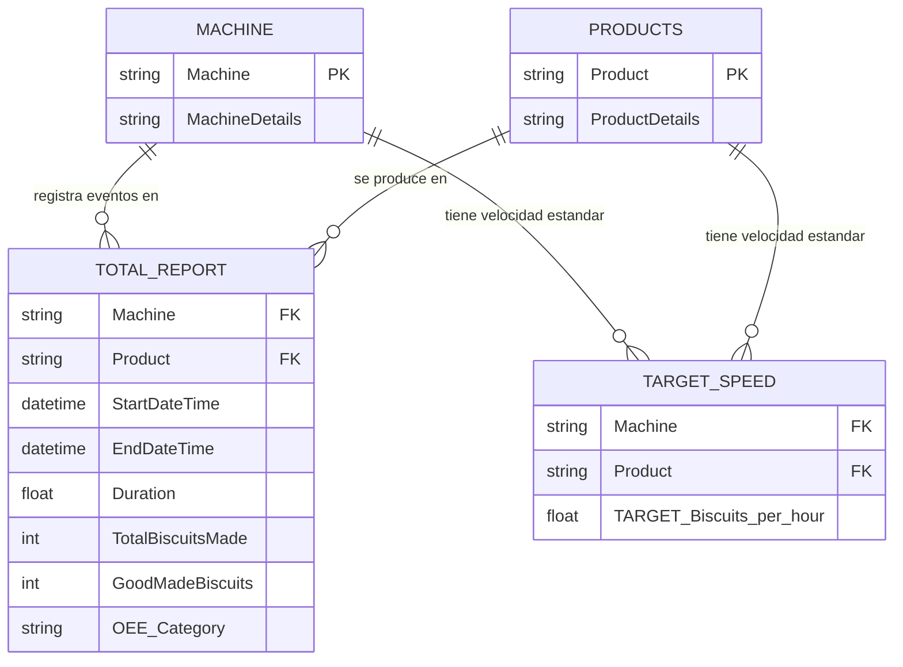

# Información Oficial del Conjunto de Datos: OEE & Manufactura

* **Nombre del Dataset:** Manufacturing Dataset (Grandma EDNA’s Biscuits Manufacturing)
* **Origen / Autor:** Phuong The Son (Kaggle / Enterprise DNA Challenge)
* **Licencia:** MIT
* **Enlace Oficial:** https://www.kaggle.com/datasets/phuongtheson/manufacturing-dataset
* **Referencia Metodológica:** Enterprise DNA OEE Manufacturing Report Challenge & Fabriq Tech OEE Guide

---

## 1. Resumen Ejecutivo y Contexto
Conjunto de datos real extraído de sensores IoT industriales y registros de producción de una fábrica de manufactura de alimentos (planta de horneado y envasado de galletas) recopilado en **julio de 2021**.

Está diseñado específicamente con una arquitectura de datos relacional para medir, descomponer y optimizar la **Efectividad Global de los Equipos (OEE - Overall Equipment Effectiveness)** a lo largo de toda la línea de producción.

---

## 2. Arquitectura de Datos: Esquema Estrella (Star Schema)
El dataset se compone de **4 archivos CSV interconectados**:

---

## 3. Diccionario Detallado de las 4 Tablas

### Tabla 1: `Total Report.csv` (Tabla de Hechos / Fact Table)
Contiene los registros de eventos de máquina en tiempo real (operación continua, tiempos de parada, producción total y unidades conformes):

| Campo | Tipo de Dato | Descripción Operativa |
|---|---|---|
| `Machine` | Texto (String) | Nombre o identificador del equipo en la línea de producción |
| `StartDateTime` | DateTime | Marca de tiempo exacta del inicio del evento o parada de máquina |
| `EndDateTime` | DateTime | Marca de tiempo exacta de finalización del evento |
| `Duration` | Numérico (Float) | Duración total del evento medida en **minutos** |
| `TotalBiscuitsMade` | Entero (Integer) | Total de unidades brutas producidas en el intervalo (incluye defectos/mermas) |
| `GoodMadeBiscuits` | Entero (Integer) | Unidades de primera calidad aprobadas por inspección |
| `OEE Category` | Categórico | Estado operativo de la máquina durante el evento:  • **`Run Time`**: Tiempo efectivo de producción. • **`CC`**: *Changeover Cleaning* (Parada de cambio de formato y limpieza / SMED). • **`PM`**: *Preventive Maintenance* (Mantenimiento preventivo planificado). • **`NO`**: *No Order* (Sin orden de trabajo / parada por planeación). |
| `Product` | Texto (String) | Referencia o SKU específico elaborado en ese bache |

### Tabla 2: `Target Speed.csv` (Velocidad Estándar de Ingeniería)
Define la velocidad nominal requerida para el cálculo del componente de Rendimiento (*Performance*) del OEE:

| Campo | Tipo de Dato | Descripción Operativa |
|---|---|---|
| `Machine` | Texto (String) | Nombre del equipo específico |
| `Product` | Texto (String) | Línea de producto asociada |
| `TARGET_Biscuits_per_hour`| Numérico (Float) | **Velocidad estándar de diseño** que la máquina debe alcanzar (unidades/hora) |

### Tabla 3: `Products.csv` (Dimensión de Productos)
* Datos maestros que definen cada línea de producto y sus especificaciones de envasado y empaque secundario/terciario (número de unidades por paquete, caja o pallet).

### Tabla 4: `Machine.csv` (Dimensión de Maquinaria)
* Clasificación y especificaciones técnicas de los activos de la planta a lo largo de las etapas del proceso (Mezclado / *Mixing*, Calentamiento-Horneado / *Heating*, Formado / *Forming*, Envasado / *Packaging*).

---

## 4. Archivos Esperados en esta Carpeta
Para comenzar el análisis, asegúrate de colocar aquí los 4 archivos CSV descargados:
1. `Total Report.csv`
2. `Target Speed.csv`
3. `Products.csv`
4. `Machine.csv`
