# 📋 MATRIZ TÉCNICA SMED: REDUCCIÓN DE TIEMPOS DE CAMBIO DE FORMATO
**Proyecto:** 02_Analisis_OEE_Paradas_SMED  
**Activo Crítico:** Llenadora de Galletas (`Biscuit Filling Machine`) - Cuello de Botella de la Línea 1  
**Operación Analizada:** Cambio de Receta y Lavado Sanitario (`CC`) de *Custard Creams* a *Jammy Creams*  
**Autor:** Angelo Apolo | Ing. Químico / Industrial | Especialista en Lean Operations  
**Archivo Excel Complementario:** [`entregables_planta/Matriz_SMED_Reduccion_Setups.xlsx`](Matriz_SMED_Reduccion_Setups.xlsx)

---

## 🎯 1. Objetivo Operacional y Alcance

La Llenadora (`Biscuit Filling Machine`) perdió **182.5 horas** en julio de 2021 bajo el código `CC (Changeover Cleaning)`.  
Nuestra auditoría forense demostró que:
* **123.52 horas (1,957 eventos)** corresponden a **cambios y limpiezas rutinarias legítimas ($\le 60\text{ min}$)**, con un promedio de 3.8 minutos en micro-ajustes y hasta 45 minutos en limpiezas mayores inter-sabor.
* **58.98 horas (23 eventos)** fueron averías mecánicas y atascos graves (> 1 hora) que deben ser atacadas con TPM.

El objetivo de esta Matriz SMED (*Single-Minute Exchange of Die*) es **reducir en al menos un 40% el tiempo de parada rutinaria de la Llenadora**, aplicando las 4 etapas de Shigeo Shingo para liberar **49.4 horas de marcha pura al mes (+22.48 millones de galletas vendibles al año con Capex Cero)**.

---

## 📊 2. Matriz Detallada Paso a Paso (Antes vs. Después)

A continuación se detalla el mapeo de las 11 tareas que componen el cambio de formato mayor (de crema blanca de vainilla a mermelada/crema de frambuesa):

| Paso | Descripción Operativa de la Tarea | Responsable | Clasificación Actual (Antes) | Tiempo Antes (min) | Estrategia Lean / SMED | Clasificación Propuesta (Después) | Tiempo Después (min) | Ahorro (min) | % Red. | Técnica de Mejora Aplicada |
| :---: | :--- | :---: | :---: | :---: | :--- | :---: | :---: | :---: | :---: | :--- |
| **1** | Parada de máquina, corte de energía y aplicación de LOTO | Operador 1 | **Interna** | 3.0 min | Mantener como interna por seguridad. Checklist visual de 3 puntos. | **Interna** | 2.0 min | 1.0 min | 33.3% | Estandarización 5S |
| **2** | Buscar llaves fijas y Allen en el taller mecánico | Operador 2 | **Interna** | 5.0 min | **Convertir a Externa.** Carro móvil 5S con herramientas fijas al pie de máquina antes de apagar. | **Externa** 🟢 | **0.0 min** | **5.0 min** | **100%** | Conversión a Externa (OED) |
| **3** | Esperar la nueva crema y mermelada desde almacén | Operador 1 | **Interna** | 6.0 min | **Convertir a Externa.** Tanque pulmón pre-posicionado y atemperado a 28°C 15 min antes de fin de lote. | **Externa** 🟢 | **0.0 min** | **6.0 min** | **100%** | Conversión a Externa (OED) |
| **4** | Drenar y purgar residuos de crema del lote anterior en tolva | Operador 1 | **Interna** | 4.0 min | Mantener interna. Válvula de bola de descarga rápida hacia manguera de desagüe directo. | **Interna** | 2.5 min | 1.5 min | 37.5% | Simplificación Técnica |
| **5** | Desmontar boquillas dosificadoras y mangueras con llave | Operador 2 | **Interna** | 6.0 min | **Optimizar interna.** Reemplazar pernos roscados por abrazaderas sanitarias *Tri-Clamp* de 1/4 vuelta. | **Interna** | 1.5 min | 4.5 min | 75.0% | Sujeción Rápida Sin Llaves |
| **6** | Llevar boquillas a zona de lavado y esperar lavado manual | Operador 2 | **Interna** | 8.0 min | **Convertir a Externa.** Conjunto de cabezal gemelo limpio y pre-ensamblado listo al pie de máquina. | **Externa** 🟢 | **0.0 min** | **8.0 min** | **100%** | Cabezal Gemelo de Reemplazo |
| **7** | Instalar nuevo juego de boquillas dosificadoras limpias | Operador 1 | **Interna** | 5.0 min | Montaje rápido del cabezal gemelo limpio mediante guías deslizantes y clamp rápido. | **Interna** | 2.0 min | 3.0 min | 60.0% | Acoplamiento Rápido |
| **8** | Conectar mangueras de alimentación de crema nueva | Operador 2 | **Interna** | 3.0 min | Conectores rápidos sanitarios *Push-fit* de acople hermético sin roscas. | **Interna** | 1.0 min | 2.0 min | 66.7% | Conexión Push-fit |
| **9** | Carga de crema nueva y cebado del circuito de inyección | Operador 1 | **Interna** | 4.0 min | Carga por gravedad desde tanque pulmón sobreelevado y purga con pulsador rápido. | **Interna** | 2.0 min | 2.0 min | 50.0% | Alimentación Asistida |
| **10** | Calibración manual de gramaje a prueba y error (pesaje) | Operador 2 | **Interna** | 6.0 min | Topes micrométricos fijos con galgas de color por receta. Cero ajustes a prueba y error. | **Interna** | 2.0 min | 4.0 min | 66.7% | Calibración Rígida (Poka-Yoke) |
| **11** | Despeje de línea, retiro de LOTO y arranque de marcha | Operador 1 | **Interna** | 2.0 min | Protocolo visual de 30 segundos y confirmación en pantalla HMI. | **Interna** | 2.0 min | 0.0 min | 0.0% | Estandarización |
| **TOTAL** | **TIEMPO DE PARADA DE MÁQUINA (DOWNTIME)** | — | **100% Interno** | **45.0 min** | — | — | **15.0 min** | **30.0 min** | **66.7%** | **Meta SMED Superada** |

---

## 📈 3. Evolución del Cambio según las 4 Etapas de Shigeo Shingo

```mermaid
gantt
    title Reducción Progresiva del Tiempo de Parada (SMED)
    dateFormat X
    axisFormat %s min
    section 1. Situación Actual
    Parada Interna (45 min) :active, 0, 45
    section 2. Separación IED/OED
    Parada Interna (32 min) :crit, 0, 32
    Preparación Externa (13 min) :0, 13
    section 3. Conversión a Externa
    Parada Interna (20 min) :crit, 0, 20
    Preparación Externa (25 min) :0, 25
    section 4. Optimización Interna
    Parada Interna Final (15 min) :done, 0, 15
    Preparación Externa (20 min) :0, 20
```



### Detalle de las Etapas:
1. **Etapa 0 (Situación Inicial - 45 min de parada):** Todas las actividades se hacían con la máquina detenida, con operarios caminando hacia el taller mecánico y esperando la crema del almacén.
2. **Etapa 1 (Separación de Actividades Internas y Externas - 32 min de parada):**  
   - Se sacan fuera de la parada: la búsqueda de herramientas (Paso 2 = 5 min) y la espera de la crema nueva (Paso 3 = 6 min).
   - **Ahorro inmediato:** 13 minutos liberados (-28.9%).
3. **Etapa 2 (Conversión de Internas a Externas - 20 min de parada):**  
   - Se introduce el concepto de **Cabezal Gemelo Prelavado (*Twin Wash-Set*)**: en vez de lavar las boquillas sucias con la máquina detenida (Paso 6 = 8 min), se retira el bloque sucio y se coloca un bloque gemelo que ya fue lavado y sanitizado fuera de línea en el turno anterior.
   - **Ahorro acumulado:** 25 minutos liberados (-55.6%).
4. **Etapa 3 (Optimización de Tareas Internas - 15 min de parada):**  
   - Se reemplazan tuercas y tornillos por abrazaderas *Tri-Clamp* de 1/4 de vuelta.
   - Se eliminan las calibraciones a prueba y error con galgas de posición fijas con código de color.
   - **Tiempo final con máquina apagada:** **15.0 minutos (Reducción del 66.7% vs. los 45 min iniciales)**.

---

## 🛠️ 4. Los 4 Pilares Técnicos de Implementación (Capex Cero)

Para lograr esta reducción sin comprar maquinaria nueva, se implementan cuatro dispositivos de bajo costo:

#### Pilar 1: Carro Móvil 5S Sanitario con Atemperador de Utillaje
* Carro rodante en acero inoxidable con sombra visual (*Shadow Board*) para llaves dinamométricas, abrazaderas y juntas tóricas grado alimentario H1.
* **Sistema de Calefacción:** Incorpora una manta térmica eléctrica a 28°C para precalentar el cabezal gemelo antes del montaje, evitando el choque térmico y la cristalización prematura de la grasa.
* **Regla Lean:** *"El carro debe estar estacionado junto a la máquina 10 minutos antes de que caiga la última galleta del lote anterior"*.

### Pilar 2: Cabezal Gemelo Sanitario con Brazo Ergonómico de Gravedad Cero
* Se dispone de un segundo conjunto de boquillas dosificadoras de acero inoxidable AISI 316L (bloque CNC monobloque de 12 pistones de precisión).
* **Seguridad Ergonómica (NIOSH):** Debido al peso del conjunto (32 kg), se instala un brazo articulado neumático de gravedad cero (*Zero-Gravity Jib Hoist*) que permite a un solo operario mover el cabezal con esfuerzo <2 kg, erradicando el riesgo de lesiones lumbares.
* **Protocolo de Higiene BRCGS:** Tras ser lavado fuera de línea, el cabezal se seca con chorro de aire filtrado HEPA (0.01 µm), se desinfecta con alcohol al 70% y se almacena en bolsa sellada con precinto de caducidad de 24 horas.

### Pilar 3: Conexiones Sanitarias de 1/4 de Vuelta (*Tri-Clamp Push-Fit*)
* Se sustituyen los pernos roscados por abrazaderas sanitarias *Tri-Clamp 3A* con tuerca mariposa de cierre manual rápido.
* Mangueras de crema con acoples rápidos *Push-fit* de grado alimentario de inserción hermética instantánea.

### Pilar 4: Calibración Rígida Poka-Yoke y Liberación Digital QA (ATP Swabs)
* Galgas fijas rectificadas con código de color por receta (roja para *Jammy*, azul para *Custard*) que fijan la carrera del émbolo en 10 segundos sin ensayo y error.
* **Validación Sanitaria en Paralelo:** En el minuto 10 al 12, el inspector de QA toma hisopado de bioluminiscencia ATP en los puntos de contacto. La lectura digital (<30 RLU) se valida en tablet mientras el operador calibra gramajes, permitiendo el arranque seguro al minuto 15 sin riesgo de retención por alérgenos.

---

## 👥 5. Diagrama Hombre-Máquina-Calidad Balanceado (15.0 Minutos Reales)

```
MINUTO        OPERADOR 1 (Mecánica/Llenadora)          OPERADOR 2 (Fluídica/Alimentación)       INSPECTOR QA (Calidad)
────────────  ──────────────────────────────────       ──────────────────────────────────       ──────────────────────
0.0 - 2.0     Aplicar LOTO + Desacoplar mangueras      Drenar crema remanente a contenedor      Verificar despeje de línea
2.0 - 4.5     Desajustar clamps con Operador 2         Retirar clamps Tri-Clamp con Op 1        Inspección visual tolva
4.5 - 7.5     Desmontar cabezal sucio (a 4 manos con Op 2 usando brazo pescante neumático)      Preparar kit hisopado ATP
7.5 - 10.5    Instalar cabezal gemelo atemperado (a 4 manos con Op 2 usando brazo pescante)     Tomar hisopado ATP en boquillas
10.5 - 12.5   Conectar mangueras Push-fit y galga      Cargar nueva crema desde tanque 30°C     Lectura ATP en luminómetro (<30 RLU)
12.5 - 14.0   Cebado rápido del circuito con Op 2      Ajuste micrométrico de gramaje           Validación y firma en Tablet
14.0 - 15.0   Retirar LOTO + Verificación perimetral   Checklist visual de herramientas 5S      Liberación Oficial del Lote
15.0 ──────── ARRANCAR LÍNEA 1 EN VELOCIDAD CONTROLADA (RAMP-UP RÁPIDO Y PRECISO) ──────────────────────────────────
```

---

## 💰 6. Impacto Operacional y Financiero Auditado

* **Horas de parada rutinaria recuperadas en la Llenadora:** **49.41 horas al mes** (592.9 horas al año).
* **Capacidad de producción bruta liberada:** $49.41 \text{ h} \times 38,506 \text{ u/h} =$ **1,902,631 galletas/mes**.
* **Producción vendible neta (ajustada por 1.5% de merma de arranque):** **1,874,092 galletas/mes (22.48 Millones al año)**.
* **Cajas comerciales adicionales (144 galletas/caja):** **156,174 cajas al año**.
* **Beneficio económico bruto (a margen estimado de $3.50 USD/caja):** **$546,609 USD / año**.
* **Ahorro en horas extraordinarias de fin de semana:** **$35,000 USD / año**.
* **Beneficio Total Anual Proyectado:** **$581,609 USD / año**.
* **Inversión de Ingeniería Auditada (Capex/Opex Robusto):** **$23,800 USD** (Cabezal CNC AISI 316L, tanque encamisado 30°C, brazo pescante neumático, carro 5S térmico, galgas y kit luminómetro ATP).
* **Período de Recuperación de Inversión (Payback Real):** **14.9 días de operación** (frente a 9 meses de espera y $250,000 de una máquina nueva).

---
*Documento auditado y validado según los hallazgos de [`docs/AUDITORIA_INTEGRAL_FASE_3_PREMORTEM_Y_FALLAS_SMED.md`](../docs/AUDITORIA_INTEGRAL_FASE_3_PREMORTEM_Y_FALLAS_SMED.md). Complementar con el archivo Excel interactivo.*
